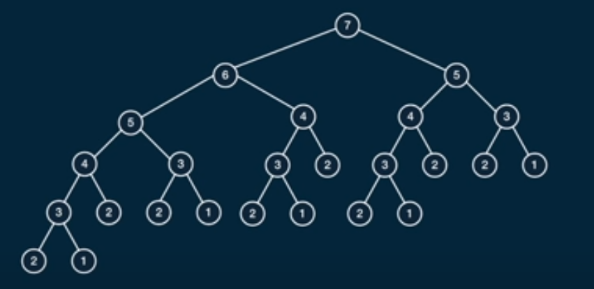
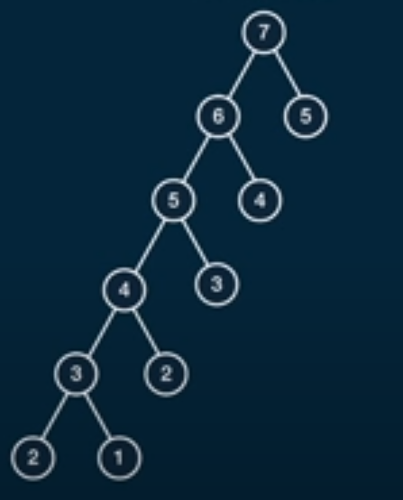
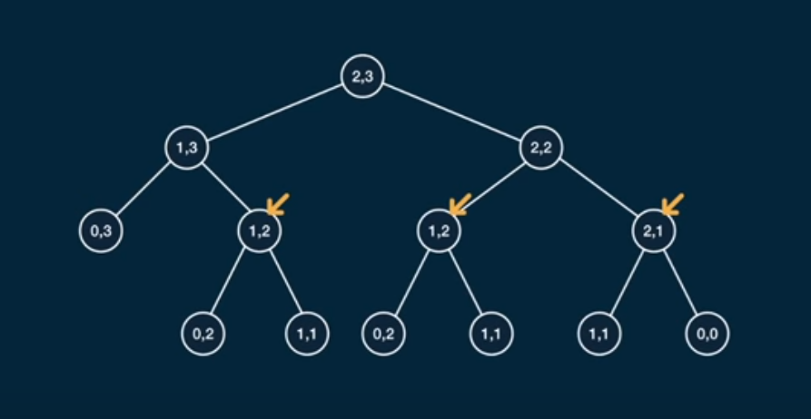
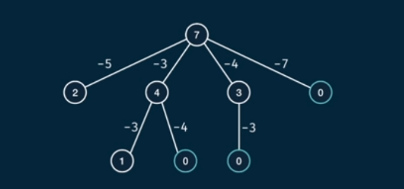
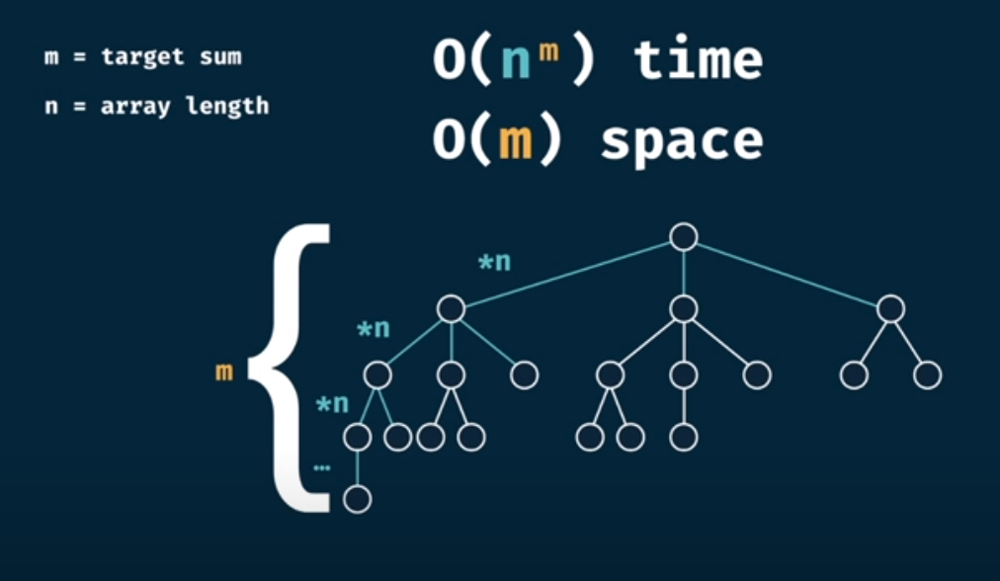
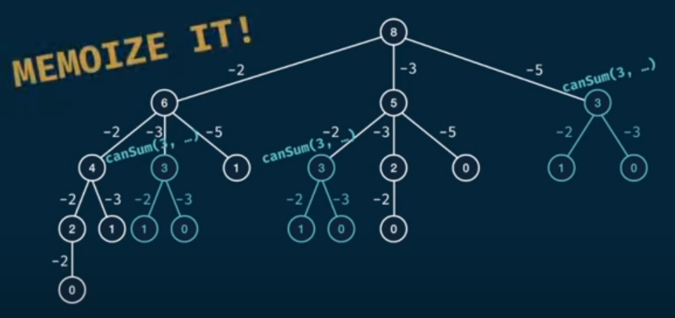

# Dynamic Programming

## Fibonnaci Problem

### Memoization of fibonacci

this technique is meant to make a function has a memory to remember its input values accordingly to their outputs to avoid time processing this input again

this technique can be simplified with Fibonacci function that takes n number as a fibonacci index and returns the number of fibonnaci value at that index

so if we want to find fibonacci of 7 the we need to follow this tree

from this tree we find that time complexity of our code is O(n)= 2^n and space Complexity is S(n)

but if we use memoization we notice that this tree would have less nodes such that

and we will notice that the time complexity enhanced such that it would be O(n) = n and space complexity become S(n) = 2n

### Tabulation of fibonacci

this technique rely on creating table of values from 0 to the n number and each time we will initialize the table with the sum of previous values it is much like the iterative approach of fibonacci problem

#### **Brute Force:**

**Time Complexity** O(n) = 2^n

**Space Complexity** S(n) = n

#### **with memization:**

**Time Complexity** O(n) = n

**Space Complexity** S(n) = 2n ~= n

#### **with Tabulation:**

**Time Complexity** O(n) = n

**Space Complexity** S(n) = n

## Grid Traveler

this problem has a grid of **m x n** and we have a start and end that we need to move from start to and count that route and so on till finding how many routs available to move from start to end in this grid

this is a dynamic programming problem where we can divide the grid into smaller grid according to where we are gona move right or down or top or left this technique is going to divide the grid into smaller one and trying to solve it such that

from this tree we notice that each time the code is moving right and left and the depth is depending on **n+m-2** ~= **n+m**  that gives us a time complexity on **2^(n+m)**

### Memoization of grid traveler

for this technique we are gona make array fro memoization and we are gona pass this array to our function and for memoization function we notice that **F(m,n) = F(n,m)** that mean we can memoize both of them as the same this is gona give us a more optimized function

### Tabulation of grid traveler

here we create a table of **M x N** that has a time complexity of O(mn) and space complexity of S(mn) and after initilaizing the table[1][1] = 1 and on each element we need to add and the right and down elements to current element and put that accordingly on right and down elements

#### **Brute Force**

**Time Complexity** O(n) = 2^(n+m)  

**Space Complexity** S(n) = n+m

#### **with memization**

**Time Complexity** O(n) = (n+m)  

**Space Complexity** S(n) = n+m

#### **with Tabulation**

**Time Complexity** O(n) = (nm)  

**Space Complexity** S(n) = nm

## Alvin's Memoization Recipe

1. Make it work.
   1. Visualize the problem as a tree
   2. implement the tree using recursion
   3. test it
2. Make it efficient.
   1. add memo object
   2. add a base cast to return memo values
   3. store return values into the memo

## Alvin's Tabulation Recipe

1. visualize the problem as a table
2. size the table based on the inputs
3. initialize the table with default values
4. seed the trivial answer into the table
5. iterate through the table
6. fill further positions based on the current position

## CanSum Problem

this problem finds is a sum of a number is available from a given array for example
if we have target of 7 and we have an array of {5,3,4,7} then we have a sum at 3+4 = 8 then the function that takes those arguments should return true representing that the sum is found

there is away using recursion can be done, using that tree we can formulate the code

and in order to find the time complexity we need to list those bullet points

- at each node branching occures by n array elements
- for the worst case (1) found in the array the tree depth is m

then from this image we can formulate the time Complexity

then now we can calculate the time complexity as O(n^m)

and space complexity as S(n) = m depth of the tree

### Memoization

this memo function can be evaluated with target Number if we found a repeated TargetNumber then we need to retrieve the output value

### Tabulation

first we need to represent the solution in a table format such that we will create a table of targetSum length then initialize it with false and initialize the first index of 0 with true value then loop over the target and on each iteration we need to sum that index to the current array number within a loop and put that index by true and if we reach the final index with false then there is no sum if it is true the the sum is found

### Brute Force

**Time Complexity** = O(n^m)
**Space Complexity** = O(m)

### With Memoization

**Time Complexity** = O(m*n)
**Space Complexity** = O(m)

### with Tabulation

**Time Complexity** = O(m*n)
**Space Complexity** = O(m)

<!-- ## HowSum Problem -->

## Alvin's Dynamic Programming Advices

- Notice any overlapping subproblems

- decide what is the trivially smallest input

- think recursively to use memoization

- think iteratively to use Tabulation

- draw a strategy first!!!

Reference for this Wrapping up can be found [here](#https://www.youtube.com/watch?v=oBt53YbR9Kk)
