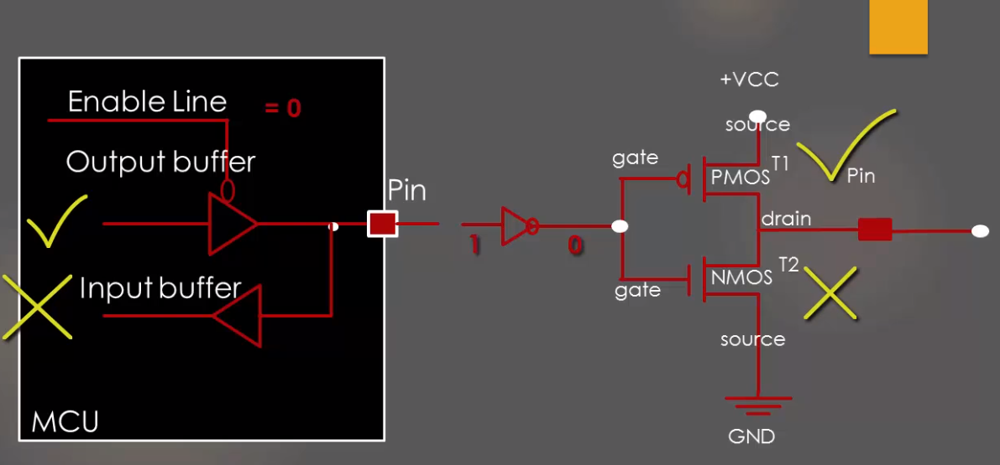
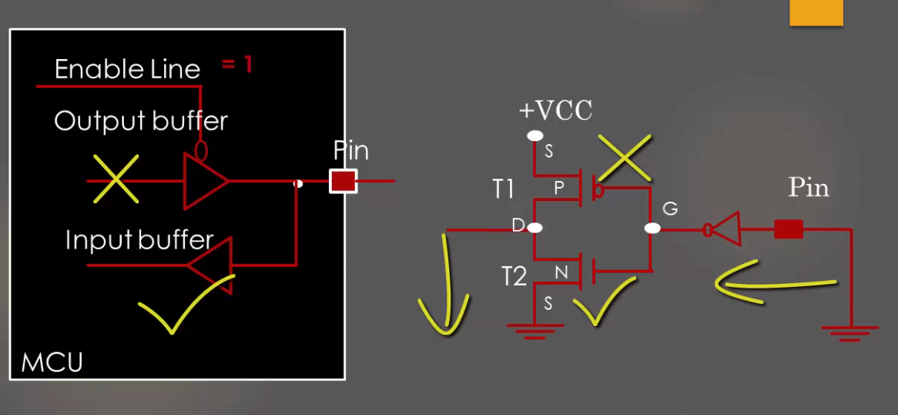
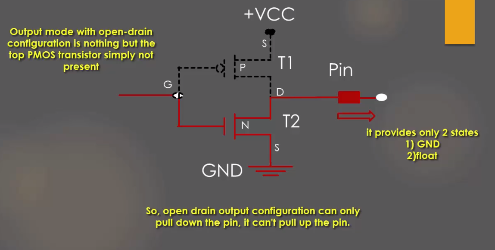

# I/O Peripheral

## Revision Topics

### **how can we assign a peripheral address to a structure of a structly defined registers?**

first we need to define the structure ataking care of each variable size as the register size which is based on architecture

1. first define the structure

```C

#define   __I     volatile const /*!< Defines 'read only' permissions */

#define     __O     volatile /*!< Defines 'write only' permissions */

#define     __IO    volatile /*!< Defines 'read / write' permissions */

typedef struct
{
  __IO uint32_t CR;
  __IO uint32_t CFGR;
  __IO uint32_t CIR;
  __IO uint32_t APB2RSTR;
  __IO uint32_t APB1RSTR;
  __IO uint32_t AHBENR;
  __IO uint32_t APB2ENR;
  __IO uint32_t APB1ENR;
  __IO uint32_t BDCR;
  __IO uint32_t CSR;
} RCC_TypeDef;
```

using **__IO** to force optimization of the compiler to not moving this value outside the cash memory Registers R1 to R15

### volatile

- The volatile keyword is intended to prevent the compiler from applying any optimizations on objects that can change in ways that cannot be determined by the compiler.

- Objects declared as volatile are removed from optimization because their values can be changed by code outside the scope of current code at any time as threads.

- The system always reads the current value of a volatile object from the memory location rather than keeping its value in temporary register at the point it is requested, even if a previous instruction asked for a value from the same object.

**So the simple question is, how can value of a variable change in such a way that compiler cannot predict ?**
Consider the following cases for answer to this question**

- when there is an interrupt the compiler optimization force the code to copy this variable value into cash and deal with it and then passes it back to the global variable to speed up the context-switching of the interrupt but what is this value changed in reference during interrup? the interrupt doesn't feel that change so will push a wrong value back

- the same case in the RTOS the variable is changed in a task but it's change doesn't reflected in another task so we have to make it a volatile variable to keep reading this variable from it's location which is in our case in peripherals location

2. we need to locate the address of that type then assign this address of type **RCC_TypeDef** to make instance of that type such as **RCC1**,**RCC** and so on

```c

#define PERIPH_BASE           0x40000000UL

#define AHBPERIPH_BASE        (PERIPH_BASE + 0x00020000UL)

#define RCC_BASE              (AHBPERIPH_BASE + 0x00001000UL)

#define RCC                 ((RCC_TypeDef *)RCC_BASE) //this is the instace we will use next we can define as many as we want but with proper offset from RCC_BASE address

```

so to configure a pin as output according to the datasheet

```C
#include "stm32f1xx_hal.h"

int main(void)
{
    //set bit 4 connect the clock to peripheral GPIOC
    RCC->APB2ENR |= (1<<4);

    //set bits 20 & 21 for configure registers high pins 8-16    11: Output mode, max speed 50 MHz.
    GPIOC->CRH |= ( (1<<20 ) | ( 1<<21 )); 
    
    //clear bits 22, 23 for configure registers high pins 8-16 in output mode 00: General purpose output push-pull
    GPIOC->CRH &= ~( (1<<22) | (1<<23) );

    while (1)
    {
        //BSRR register is used to set and reset the pins at the same time from one register

        int i;
        for(i=0;i<100000;i++);//polling over a counter delay
        GPIOC->BSRR = (1<<13); // sets from a set bit make logic 1 means led off

        for(i=0;i<100000;i++);//delay
        GPIOC->BSRR = (1<<(13+16)); // reset from a reset bit make logic 0 means led on
  }
}
```

### to define a switch of Input we can make it such that

```C
#include "stm32f1xx_hal.h"

int main(void)
{
  RCC->APB2ENR |= (1<<4) | (1<<2);//set bit 4 GPIOC , bit 2 GPIOA clock

  //GPIOA input Configurations
  //configure the pin5 as input
  GPIOA->CRL &= ~((1<<20) | (1<<21) | (1<<22)); //clear bit20,21
  GPIOA->CRL |= (1<<23); //set bit23

  //GPIOC output Configurations
  GPIOC->CRH |= ( (1<<20 ) | ( 1<<21 ));//set bits 20 & 21
  GPIOC->CRH &= ~( (1<<22) | (1<<23) );//clear bits 22, 23

  while (1)
  {
    if(GPIOA->IDR & (1<<5)){
      //reads high on pin5
      GPIOC->BSRR = (1<<13);
    }else{
      //reads low on pin5
      GPIOC->BSRR = (1<<(13+16));
    }
  }
}
```

### GPIO Output internal structure



### GPIO Input internal structure



### Open Drain internal Configuration



## GPIO interrupts

interrupts are mapped in the vector table in startup code in our startup code file this file is had all lookup function names for all available interrupt which will be executed when interrupts are enabled via registers then this function should be called when event happen by hardware or external signal or data

- first we have to disable irq(interrupt request main flag)
- then we need to configure the cpu registers of alternate function to map our pin to EXTI peripheral from **AFIO->EXTICR**
- second we need to define type for our pin as non maskable interrupt type which means it can interrupt the processor any time and its call will be done immediately before current instruction
- then we need to define interrupt occurs on rising trigger
- then command NVIC module to enable interrupt line for EXTI handler to take action when interrupt occurs
- then enable global flag (enable irq) for our processor to start taking actions when signal is comming

```C
  __disable_irq();
    // map the pin to EXTI peripheral
    AFIO->EXTICR[0] = 0x00; // map port A to EXTI periheral
    //enable the interrupt activity
    EXTI->IMR |=1; //not maskable interrupt enabled
    EXTI->RTSR |= 1;//interrupt occurs on rising trigger
    NVIC_EnableIRQ(EXTI0_IRQn);//enable EXTI0 for NVIC peripheral which connects interrupt signal from exti peripheral
    __enable_irq();//enable processor main interrupt flag
```

## Systic timer

systic is just a counter localized with cpu core and is meant to be used for OS tasks

### Operation

- first it consists of 4 registers we use 3 of them to have a fully operational Systick counter
- **CTRL** is used to
  - enable and disable counter
  - enable/disable interrupts
  - define clock source of AHB or AHB/8
  - last bit is used to read reaching t 0 state since last read operation of this flag
- **Load** used to load the counter with counting value when the
counter is enabled and when it reaches 0 The RELOAD value can be any value in the range 0x00000001-0x00FFFFFF. A start value of 0 is possible, but has no effect because the SysTick exception request and COUNTFLAG are activated when counting from 1 to 0.
- The VAL register contains the current value of the SysTick counter.
Reads return the current value of the SysTick counter.

### **SysTick design hints and tips**  

The SysTick counter runs on the processor clock. If this clock signal is stopped for low
power mode, the SysTick counter stops.
Ensure software uses aligned word accesses to access the SysTick registers.
The SysTick counter reload and current value are undefined at reset, the correct
initialization sequence for the SysTick counter is:

1. Program reload value. **_LOAD**
2. Clear current value. **_VAL**
3. Program Control and Status register. **_CTRL**
