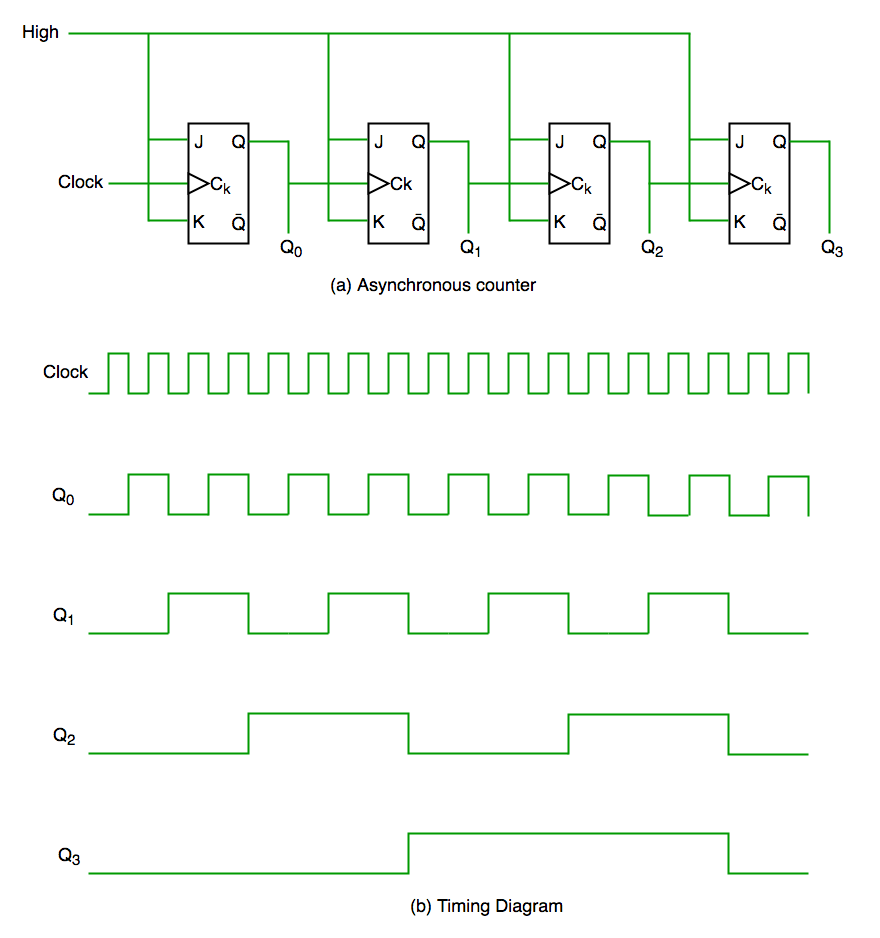
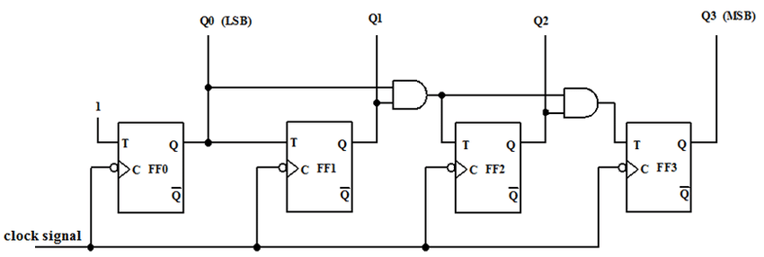
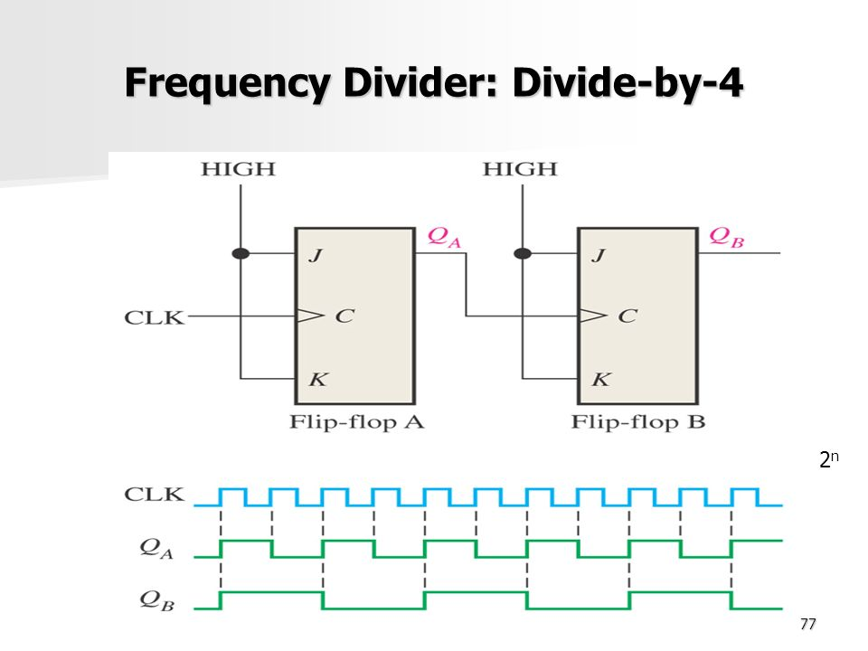
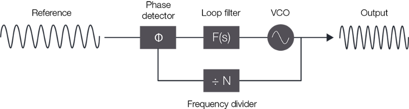

# Timers

timers are counters connected to a certain clock and can trigger an interrupt and can be configured to work as PWM or input capture to measure a signal frequency

types of counters

- **Asynchronous Counter**  
    is a counter consisting of many **JK-flip-flop** connected together with different clock source as follows  
    
- **Synchronous Counter**  
  is a series of registers connected with the same clock source  
  

for our stm kit it have three types of Timers

- Basic Timers
- General Purpose Timers
- Advanced Timers

each type has different features according to our usage and application but for now the main features we gona need is delay, timers interrupts, PWM and Input capture

- **Timer Operation**
  - first we need to enable clock for the selected timer
  - second we need to define the clock divider through **PSC** regiseter
  - third we need to define clock counter **ARR** register to divide the clock cycle to reset after this register Value so for a delay function we can continuously check the **CNT** value reaches a certain value also we need to start the counter and define the counting mode with **CR1** register

    ```C
    RCC->APB1ENR |= (1<<2);//enable clock for timer 4 peripheral

    TIM4->PSC = 8; //define clock divider
    TIM4->ARR = 1000;//define Auto reload register value when CNT reaches this value it will reset to 0 and start over according to counting mode
    TIM4->CR1 |= bit(0) | bit(2);//enable counter and define counting mode
    while( TIM4->CNT != 1000 );
    ```

## Some Notes

### Clock Divider Circuit Diagram

it is used on register **PSC** to divide input clock to timer peripheral  



## Clock Multiplier

it is used on RCC to increase the clock  


this circuit consists of

- **phase-locked loop**  
    which takes two digital signals and determines the phase difference between them in order to reduce the error in phase of generated signal

- **low pass filter**  
    this circuit is noting more a resistor and a capacitor to block phase detector AC or high frequency part
- **VCO** Voltage controlled Osillator  
    this circuit has many configurations such as ordinary OSCILLATOR circuit and RCL circuit at resonance level and 555 circuit can ne used too, this block is responsible for generating a frequency at a certain voltage level

this frequency generated through **VCO** is divided by **n** (multiplied frequency value) and passed to **phase detector** to identify the error in phase between the input and output signal then try to correct the phase by generating apropriate voltage level to generate apropriate frequency with **VCO**
