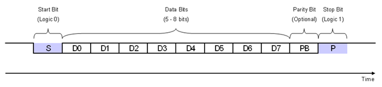
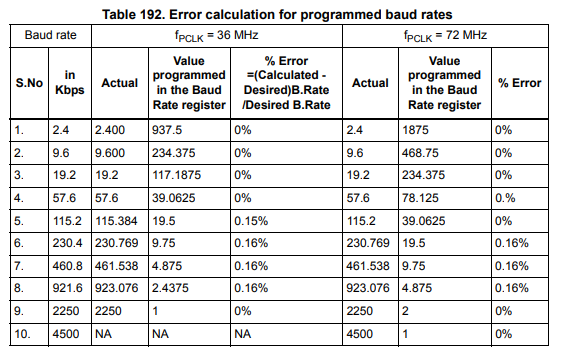

# UART

is a universal asynchronous receive and transmit communication protocole that uses two wires for communication between **MCUs** it have these features

- Synchronous and asynchronous modes
- fixed Baud-Rates
- two wires for communication **TX** & **RX**

## Data Frame Diagram

Data on the bus (TX pin) has a shape that is meant to be understood by the other MCUs with it's uart peripheral

this data frame or data package has

- start bit (1 bit width)
- data bits (from 5 to 9 bits width)
- parity bit (1 bit width)  
- stop bit (1 to 2 bit width)

**start** bit is alwats low and stop bit usually is high and data is been choosen according to our usage
  
but if we want to extend our memory or use a signed data type variables and extend this functionality we can use 9 it data but usually we handle that in our application and stick with 8-bit data
  
also **parity bit** is one of the simplest ways of error detection, The parity bit ensures that the total number of 1-bits in the string is even or odd.
  
**9600/8-N-1** is a common shorthand notation for a serial port parameter setting or configuration in asynchronous mode

## Baud Rate generation

The baud rate for the receiver and transmitter (Rx and Tx) are both set to the same value as programmed in the **Mantissa** and **Fraction** values of USARTDIV.

**Tx/Rx baud = Fclk/(16*USARTDIV)**
**USARTDIV = DIV_Mantissa + (DIV_Fraction / 16)**
Fclk - Input clock to the peripheral (PCLK1 for USART2, 3, 4, 5 or PCLK2 for USART1)

**Note:** The baud counters are updated with the new value of the Baud registers after a write to
USART_BRR. Hence the Baud rate register value should not be changed during
communication.

## **Note:**

The lower the CPU clock the lower will be the accuracy for a particular Baud rate. The upper
limit of the achievable baud rate can be fixed with this data.
Only USART1 is clocked with PCLK2 (72 MHz Max). Other USARTs are clocked with
PCLK1 (36 MHz Max).

## Error Calculation for USART Baud-Rates

## Multiprocessor communication

There is a possibility of performing multiprocessor communication with the USART (several
USARTs connected in a network). For instance, one of the USARTs can be the master, its
TX output is connected to the RX input of the other USART. The others are slaves, their
respective TX outputs are logically ANDed  together and connected to the RX input of the
master.

if we use muted mode we may connect them together directly and only the selected by address one will have the bus.

In multiprocessor configurations it is often desirable that only the intended message
recipient should actively receive the full message contents, thus reducing redundant USART
service overhead for all non addressed receivers.
