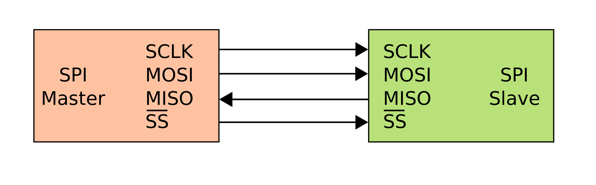
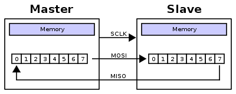
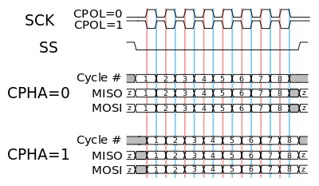
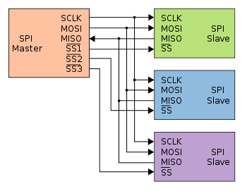
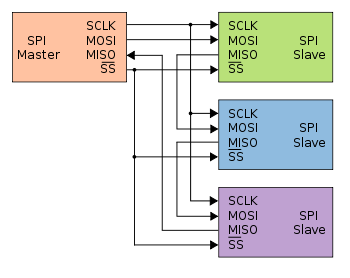

# SPI (Serial Peripheral Interface)

a communication protocole developed by motorolla in 1979

core features

- mainly a master-slave communication
- master can communicate with many slaves
- have 4 wires for communication or more according to number of slaves to be communicating with
  - SCLK: Serial Clock (output from master)
  - MOSI: Master Out Slave In (data output from master)
  - MISO: Master In Slave Out (data output from slave)
  - CS /SS: Chip/Slave Select (often active low, output from master to indicate that data is being sent)
- have a clock pin for synchronization between master and slave which reduce errors while Communication
- described as a synchronous serial interface

## Data Transmission Operation

The SPI bus can operate with a single master device and with one or more slave devices, To begin communication, the bus **master configures the clock**, using a frequency supported by the slave device, typically up to a few MHz. The master then selects the slave device with a logic level 0 on the select line (ss pin).During each SPI clock cycle, a full-duplex data transmission occurs. The master sends a bit on the MOSI line and the slave reads it, while the slave sends a bit on the MISO line and the master reads it. This sequence is maintained even when only one-directional data transfer is intended.

Transmissions normally involve two shift registers of some given word-size, such as eight bits, one in the master and one in the slave; they are connected in a virtual ring topology. Data is usually shifted out with the most significant bit first. On the clock edge, both master and slave shift out a bit and output it on the transmission line to the counterpart. On the next clock edge, at each receiver the bit is sampled from the transmission line and set as a new least-significant bit of the shift register. After the register bits have been shifted out and in, the master and slave have exchanged register values. If more data needs to be exchanged, the shift registers are reloaded and the process repeats. Transmission may continue for any number of clock cycles. When complete, the master stops toggling the clock signal, and typically deselects the slave

## Clock Polarity

**Clock Polarity** determines the polarity of the clock. The polarities can be converted with a simple inverter.

- CPOL=0 is a clock which idles at 0, and each cycle consists of a pulse of 1. That is, the leading edge is a rising edge, and the trailing edge is a falling edge.
- CPOL=1 is a clock which idles at 1, and each cycle consists of a pulse of 0. That is, the leading edge is a falling edge, and the trailing edge is a rising edge.

## Clock Phase

**Clock Phase** determines the timing (i.e. phase) of the data bits relative to the clock pulses. Conversion between these two forms is non-trivial.

- For **CPHA=0**, *the "out" side changes the data on the trailing edge of the preceding clock cycle, while the "in" side captures the data on (or shortly after) the leading edge of the clock cycle.* The out side holds the data valid until the trailing edge of the current clock cycle. For the first cycle, the first bit must be on the MOSI line before the leading clock edge.
An alternative way of considering it is to say that a CPHA=0 cycle consists of a half cycle with the clock idle, followed by a half cycle with the clock asserted.
An alternative way of considering it is to say that a CPHA=1 cycle consists of a half cycle with the clock asserted, followed by a half cycle with the clock idle.

- For **CPHA=1**, the "out" side changes the data on the leading edge of the current clock cycle, while the "in" side captures the data on (or shortly after) the trailing edge of the clock cycle. The out side holds the data valid until the leading edge of the following clock cycle. For the last cycle, the slave holds the MISO line valid until slave select is deasserted.
An alternative way of considering it is to say that a CPHA=1 cycle consists of a half cycle with the clock asserted, followed by a half cycle with the clock idle.

## SPI Configurations

### Independent slave configuration

  

In the independent slave configuration, there is an independent chip select line for each slave. This is the way SPI is normally used. The master asserts only one chip select at a time.

**Pull-up resistors between power source and chip select lines are recommended for systems where the master's chip select pins may default to an undefined state. When separate software routines initialize each chip select and communicate with its slave, pull-up resistors prevent other uninitialized slaves from responding.**

Since the MISO pins of the slaves are connected together, they are required to be tri-state pins (high, low or high-impedance), where the high-impedance output must be applied when the slave is not selected. Slave devices not supporting tri-state may be used in independent slave configuration by adding a tri-state buffer chip controlled by the chip select signal. (Since only a single signal line needs to be tristated per slave, one typical standard logic chip that contains four tristate buffers with independent gate inputs can be used to interface up to four slave devices to an SPI bus.)

### Daisy chain configuration

  

Some products that implement SPI may be connected in a daisy chain configuration, the first slave output being connected to the second slave input, etc. The SPI port of each slave is designed to send out during the second group of clock pulses an exact copy of the data it received during the first group of clock pulses. The whole chain acts as a communication shift register; daisy chaining is often done with shift registers to provide a bank of inputs or outputs through SPI. **Each slave copies input to output in the next clock cycle until active low SS line goes high**. Such a feature only requires a single SS line from the master, rather than a separate SS line for each slave.

Other applications that can potentially interoperate with SPI that require a daisy chain configuration include SGPIO, JTAG, and Two Wire Interface.

## Advantages

- Full duplex communication in the default version of this protocol
- Push-pull drivers (as opposed to open drain) provide good signal integrity and high speed
- Higher throughput than I²C or SMBus. Not limited to any maximum clock speed, enabling potentially high speed
- Complete protocol flexibility for the bits transferred
  - Not limited to 8-bit words
  - Arbitrary choice of message size, content, and purpose
- Extremely simple hardware interfacing
  - Typically lower power requirements than I²C or SMBus due to less circuitry (including pull up resistors)
  - No arbitration or associated failure modes - unlike CAN-bus
  - Slaves use the master's clock and do not need precision oscillators
  - Slaves do not need a unique address – unlike I²C or GPIB or SCSI
  - Transceivers are not needed - unlike CAN-bus
- Uses only four pins on IC packages, and wires in board layouts or connectors, much fewer than parallel interfaces
- At most one unique bus signal per device (chip select); all others are shared
- Signals are unidirectional allowing for easy galvanic isolation
- Simple software implementation

## Disadvantages

- Requires more pins on IC packages than I²C, even in the three-wire variant
- No in-band addressing; out-of-band chip select signals are required on shared buses
- Extensibility severely reduced when multiple slaves using different SPI Modes are required. Access is slowed down when master frequently needs to reinitialize in different modes.
- No hardware flow control by the slave (but the master can delay the next clock edge to slow the transfer rate)
- No hardware slave acknowledgment (the master could be transmitting to nowhere and not know it)
- Typically supports only one master device (depends on device's hardware implementation)
- No error-checking protocol is defined
- Without a formal standard, validating conformance is not possible
- **Only handles short distances** compared to RS-232, RS-485, or CAN-bus. (Its distance can be extended with the use of transceivers like RS-422.)
- Opto-isolators in the signal path limit the clock speed for MISO transfer because of the added delays between clock and data

## Applications

SPI is used to talk to a variety of peripherals, such as

- Sensors: temperature, pressure, ADC, touchscreens, video game controllers
- Control devices: audio codecs, digital potentiometers, DAC
- Camera lenses: Canon EF lens mount
- Communications: Ethernet, USB, USART, CAN, IEEE 802.15.4, IEEE 802.11, handheld video games
- Memory: flash and EEPROM
- Real-time clocks
- LCD, sometimes even for managing image data
- Any MMC or SD card (including SDIO variant)
