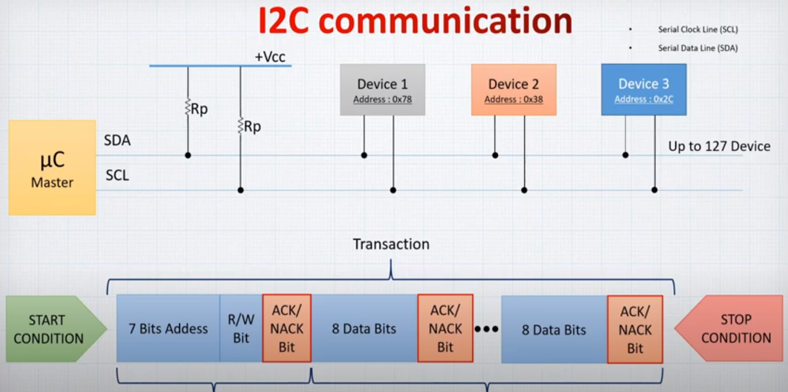

# I2C (Inter-Integrated Circuit) or TWI (Two Wire Interface)

it was originally designed by Philips Semiconductor in 1982. Recently, it is a widely used protocol for short-distance communication.
it uses only 2 bi-directional open-drain lines for data communication called SDA and SCL. Both these lines are pulled high.

for the open-Drain signals when line is in the Z-state or not defined state it may produce noise on the bus so we need to pull these two lines up to connect these two lines to logic 1

## Core Features

- **Half-duplex Communication Protocol**  
    Bi-directional communication is possible but not simultaneously.

- **Synchronous Communication**  
The data is transferred in the form of frames or blocks.

- Can be configured in a multi-master configuration.

- **Clock Stretching**  
The clock is stretched when the slave device is not ready to accept more data by holding the SCL line low, hence disabling the master to raise the clock line. Master will not be able to raise the clock line because the wires are AND wired and wait until the slave releases the SCL line to show it is ready to transfer next bit.

- **Arbitration**
I2C protocol supports multi-master bus system but more than one bus can not be used simultaneously. The SDA and SCL are monitored by the masters. If the SDA is found high when it was supposed to be low it will be inferred that another master is active and hence it stops the transfer of data.

- **Serial transmission**
I2C uses serial transmission for transmission of data.

- **Used for low-speed communication**.

- **Two wires for Communication SDA & SCL**
  - Serial Data (SDA) – Transfer of data takes place through this pin.
  - Serial Clock (SCL) – It carries the clock signal.

- communication speeds are 100 kb/s (Standard Mode), 400 kb/s (Fast Mode), newer communication speed are 1 Mbit/s (Fast Mode Plus), 3.4 Mbit/s high speed mode and 5 Mbit/s Ultra Fast-Mode

- **I2C operates in 2 modes** –
  - Master mode
  - Slave mode
  - multi-Master mode

## Operation

- **Start and Stop Conditions** :  
START and STOP can be generated by falling and rising edges on SDA line respectively while keeping the SCL line on high

- **Repeated Start Condition** :  
Between each start and stop condition pair, the bus is considered as busy and no master can take control of the bus. If the master tries to initiate a new transfer and does not want to release the bus before starting the new transfer, it issues a new START condition. It is called a **REPEATED START condition**.

- **Read/Write Bit** :  
A high Read/Write bit indicates that the master is sending the data to the slave, whereas a low Read/Write bit indicates that the master is receiving data from the slave.

- **ACK/NACK Bit** :  
After every data frame, follows an ACK/NACK bit. If the data frame is received successfully then ACK bit is sent to the sender by the receiver.

- **Addressing** :  
The address frame is the first frame after the start bit. The address of the slave with which the master wants to communicate is sent by the master to every slave connected with it. The slave then compares its own address with this address and sends ACK.

- **I2C Packet Format** :  
In the I2C communication protocol, the data is transmitted in the form of packets. These packets are 9 bits long, out of which the first 8 bits are put in SDA line and the 9th bit is reserved for ACK/NACK

- **Data transfer** :  
  - **START condition** consist of one bit falling edge
  - **Address Packet** consist of 9 bit
    - 7-bits for addressing
    - 1-bit for R/W selection
    - 1-bit for ACK/NACK which is a bit of your choice sent with data and will be received when slave of other master response
  - **one or more data packet**
    - 8-bits for data byte
    - 1-bit for ACK/NACK
  - **STOP condition** consist of one bit rising edge

### Advantages

- Can be configured in multi-master mode.
- Complexity is reduced because it uses only 2 bi-directional lines (unlike SPI Communication).
- Cost-efficient.
- It uses ACK/NACK feature due to which it has improved error handling capabilities.

### Limitations

- Slower speed.
- Half-duplex communication is used in the I2C communication protocol.
