# RTOS - Real Time Operating System

why using RTOS ?

- simple apps doesn't need RTOS but with more complex with many periodic jobs RTOS is necessary

- jobs need to have varying execution order (execution threads) with different priority levels

- Minimizing waiting time by executing other jobs instead of just waiting

- managing system resources and shared hardware

## but also we need to consider some points before using RTOS

- requires extra memory overhead

- requires execution time overhead for context switching as well as task scheduling

- porting rtos is not easy, some work only with specific microcontroller and specific toolchain

## Busy-Wait Vs Thread Scheduling

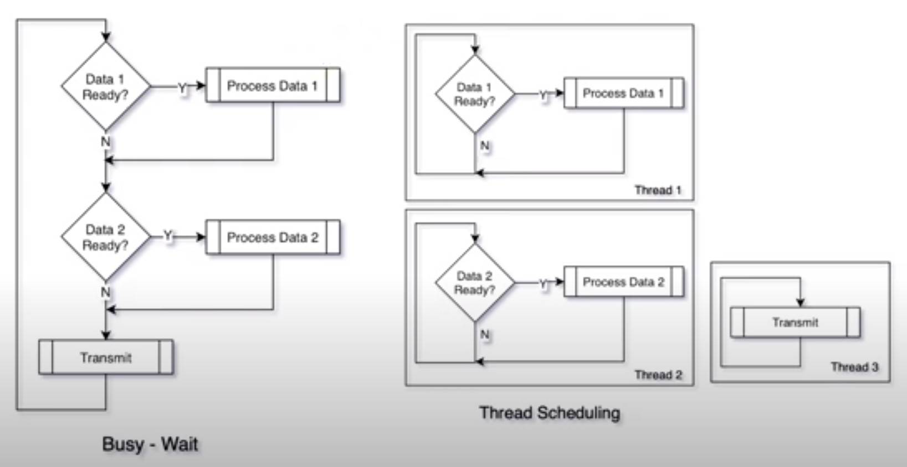

- busy-wait depends on waiting each block to finish till the next block execution

- but task scheduling depend on switching between tasks concurrently according to each task priority but only one task at a time such as **RTOS**

- for parallel programming parallel thread execution occurs at the same time on a multi-core processors

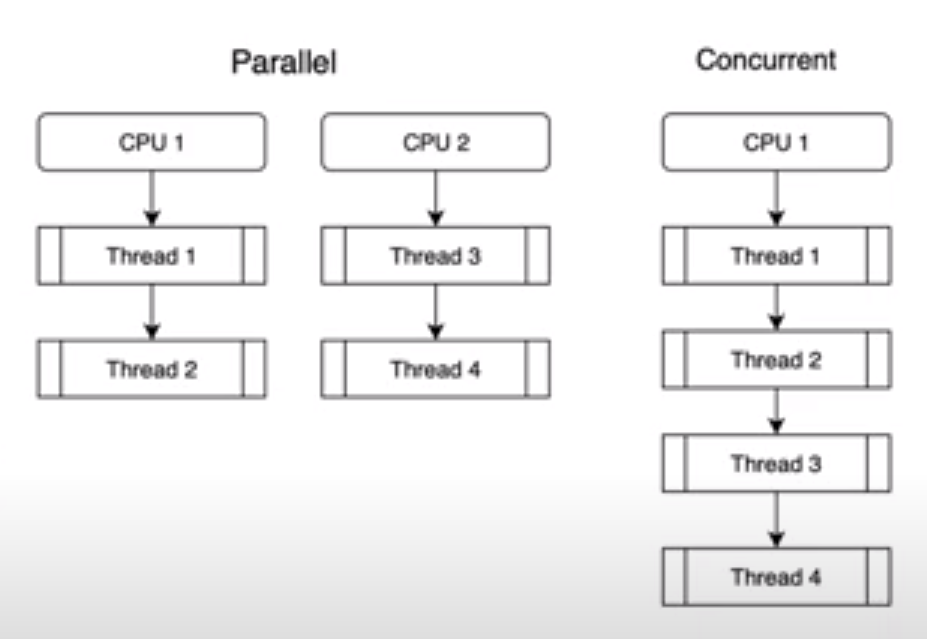

## Foreground Vs Background

- Foreground program is a program executing now

- Background program is a program interrupted and will be executed after foreground program finishes

- We can consider FreeRtos as a foreground-background system

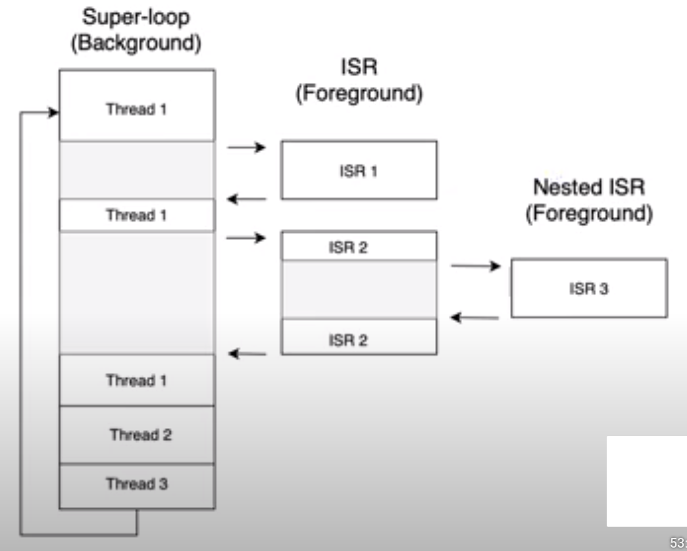

## Execution Thread

- a sequence of instructions to be executed for doing specific job
- has it's own program start address, PC, SP, CR, Flags
- when stoped or interrupted the thread status is frozen and stored into memory, so it can be restored and the thread execution can be resumed normally
- thread status called context and the memory area callled (thread control block or TCB or context space or thread object)
- single processor can run one thread at a time which called **running state** and other threads are in the **waiting state** waiting for the cpu, Resources or inputs to continue execution.
- RTOS is the piece of the software responsible for managing threads( stop, store, load, start and context switching)

## Thread Control Block

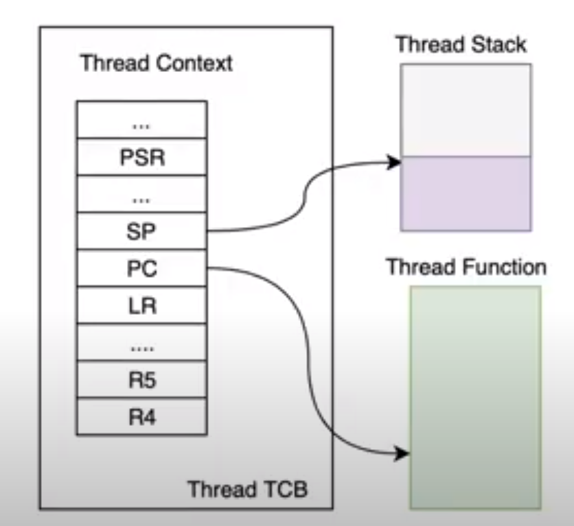

- each thread context may have priority and name

## Thread States

- thread in **running state** can ask for resources (RTOS call) for only one thread at a time
- RTOS makes the thread go into waiting state when resources are not available
- **waiting state** is associated with the event for which the thread is waiting
- IRQs can trigger some events and RTOS can move a thread from waiting to ready state.
- thread is switched from running to ready when an IRQ triggers high priority thread into ready state.

## Create Thread API

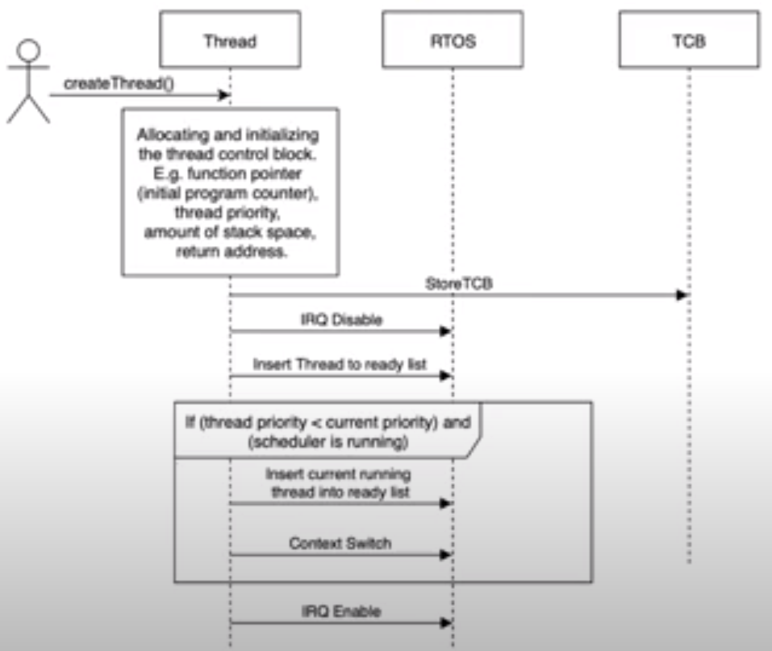

- allocating memory for TCB with initial values for PSR,SP, and stack size which we will use later while switching states
- PC value will be set by the thread starting address in flash for this specific thread
- choose a priority for this thread
- TCB located in stack memory in addition to the allocated stack size for this thread
- we need to disable interrupts here
- then we insert this thread to the ready list prioritised
- and if (thread priority < current priority and scheduler is running) we need to insert current running thread into ready state and context switch running thread and move to newly created thread
- then we need to enable IRQ

## thread Lists

- all active threads (waiting and ready) have their thread object in one linkedlist (waiting list or ready list)
- lists shall copy only the address to the thread object not the hole thread object.
- lists shall be ordered by thread priority, so that the scheduler always picks the highest priority thread.
- first node is dummy head contains number of elements in the list

## Arm CM4 OS SUPPORT FEATURES

- **shadowed stack pointer**: **MSP** is used for the os kernel and interrupt handler.**PSP** is used by application tasks.
  - Protects MSP from corruption by application task
  - stack space needed for the ISR and nested interrupt handling is allocated in the main stack only to save memory of saving context of each task while context switching
- **Systick timer**
- **SVC and PendSV** exceptions
  - SVC (SUPERVISOR CALL) Exception
    - used to trigger interrupt with SVC instruction
    - prefered over software interrupts because it generates precise interrupt(handler must execute if not will generate hardfault )
    - can be used by application tasks to request privileged access
  - PENDSV (PENDABLE SERVICE CALL) Exception
    - Triggered by software but not precise
    - Pending status can be set inside a higher priority exception handler
    - making PendSV the lowest exception priority level very usefull, allowing to trigger Context Swtch within interrupts

- **unpreveliged execution level**: security model that restricts the access rights of some application tasks
- **Execlusive access**: useful for semaphores and mutual execlusive

## PendSV for Context Switching

- depend on trigger a flag then come back to the interrupt then make a context switching according to that trigger

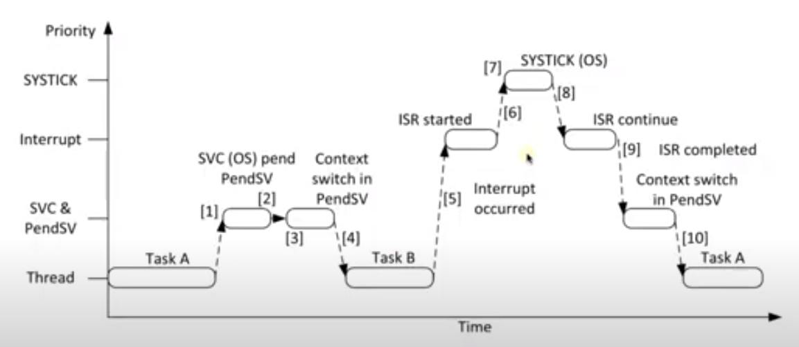

## PendSV to partition an interrupt

- depend executing a high critical part into an interrupt and moving low critical part to PendSV and after finishing high critical part in an interrupt we trigger a PendSV call then execute low critical part that can be interrupted by other high critical sections

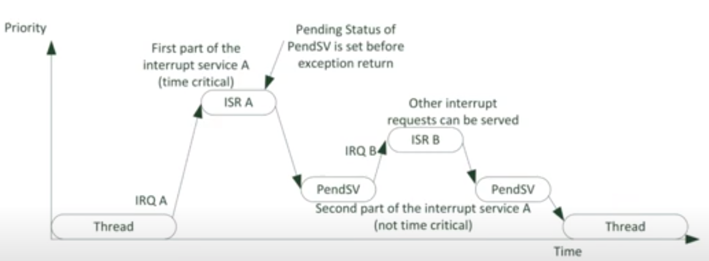

Till now we know the overview of our OS and how it will work now let's get into some code

## Architectural Steps Toward OS creation

### 1. [**Threads Create and TCP**](#threads-create-and-tcp)

### 2. [**Scheduling and Mutual Execlusion**](#scheduling-and-mutual-execlusion)

### 3. [**Mutex, Semaphore and MailBox**](#mutex-semaphore-and-mailbox)

### 4. [**Timer Support**](#timer-support)

### 5 [**other Features and Events**](#other-features-and-events)

Now let's start with our kit stm32f1 and let's build and debug c code alongside with assembly code and for some architectural organization notes we will create a new folder inside aour advanced project alongside with inc and src inside core folder and inside this file we will create a inc and src folder for our rtos and assebly files will be longside with .c files.

## **Threads Create and TCP**

- here we will use a circular-doubly statically linked list and you need to know about ISA and thumb instructions for our assembly files.

- our RTOS will use SVC, PendSV and Systic interrupts, we will force the application tasks to modify any interrupt priority except those 3 that our rtos uses

- also we will use msp for our RTOS and psp for each task

let's start by our structures we will use for each event-list and thread

### **main Structures**

- Thread structure

```C
  typedef struct thread_t
  {
    uint32_t pStackPointer;        /**< Stack pointer */
    uint32_t priority;             /**< Thread priority */
    RTOS_listItem_t item;          /**< List item of this thread */
  } RTOS_thread_t;
```

  1. TCP pointer which is 16 word starting at the top of the stack of this thread
  
  2. thread priority
  
  3. thread item (not item pointer :D) which will point to the thread item structure which will be linked to a list and point to a pointer to function of our TASKx Thread and next and prev items in the list we can consider this as a pointer to a list items of a circular-doubly linked list

- Thread Stack structure

```C
  typedef struct
  {
    uint64_t stack[THREAD_STACK_SIZE];  /**< Thread stack */
  } RTOS_stack_t;
```

  1. a thread stack with THREAD_STACK_SIZE of 1024 place of 64bit type means 1024 double word means 1024*8 = 8Kbytes for each thread

  note for our stm32f1 we can't use more than 7 threads
  thus we need to set THREAD_PRIORITY_LEVELS to 2

  if we need to use more we need to decrease stack size

- Thread Item structure

```C
  struct listItem_t
  {
    struct listItem_t * pNext;     /**< Pointer to the next list item */
    struct listItem_t * pPrev;     /**< Pointer to the previous list item */
    void * pThread;                /**< Pointer to the thread of the item */
    void * pList;                  /**< Pointer to the list in which the item it */
  };
  typedef struct listItem_t RTOS_listItem_t;
```

  1. pNext pointer pointeing to next item in the list
  2. pPrev pointer pointeing to previous item in the list
  3. pointer to the thread Task Function defined in the main.c as application Task
  4. pointer to list where the item exists (for our RTOS may be Ready ,Waiting, or suspended list and the running will be only one item not a list)

- End Thread Item

```C
typedef struct
{
  RTOS_listItem_t * pNext;     /**< Pointer to the next list item */
  RTOS_listItem_t * pPrev;     /**< Pointer to the previous list item */
} RTOS_listEnd_t;
```
  
  thread end item to save memory for each list head by creating an end type and not depending on **listItem_t** with null value for pThread :D (optimization issue here notice below)
  
  no need for list pointer because this item points to items assigned to a list and only used to interface list start to list end which can be ignored to save memory for each list.

  1. pNext pointer pointeing to next item in the list
  2. pPrev pointer pointeing to previous item in the list
  
- RTOS List

```C
  typedef struct
  {
    uint32_t numOfItems;           /**< Number of threads items in the list */
    RTOS_listItem_t * pIndex;        /**< Pointer to the current item */
    RTOS_listEnd_t listEnd;          /**< List end */
  } RTOS_list_t;
```

  1. number of items in this list
  2. pointer to current item in the list
  3. list end item

let's see some examples by graph

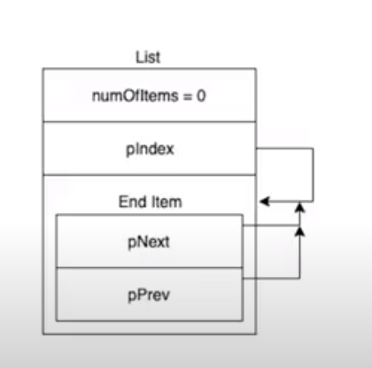

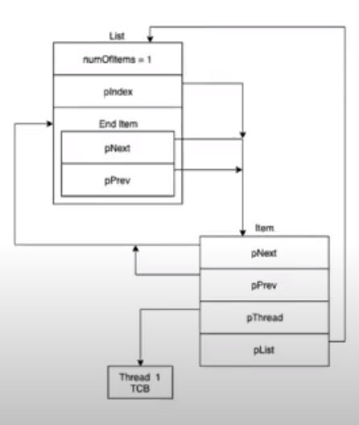

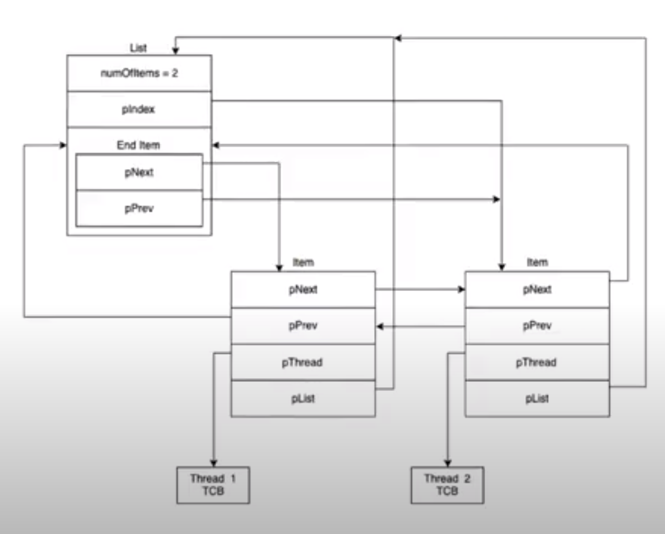

then let's get to our main functions

### **main Functions for Task Creation and Deletion**

  you can look at it's implementation in file **rtos_list.c**

  1. RTOS_listInit function
    used to initialize each list with end item in it
  2. RTOS_listInsertEnd function
    used to add item at pIndex of the list
  3. RTOS_listRemove
    used to remove item from the list
  
### functions of RTOS thread

first we need to create ready list which is an array of type list of priority levels size

and top priority item to indicate the current top priority exists we can consider this as a variable containing the current highest priority

```C
  static RTOS_list_t readyList[THREAD_PRIORITY_LEVELS];
  
  static uint32_t currentTopPriority = (THREAD_PRIORITY_LEVELS - 1);

```

then we need to indicate a pointer to the curent running thread

```C
  RTOS_thread_t * pRunningThread;
```

then we have 3 main thread functions

1. **RTOS_threadInitLists** function
  this function initializes each list item by an empty list with **endItem**
2. **RTOS_threadCreate** function  

  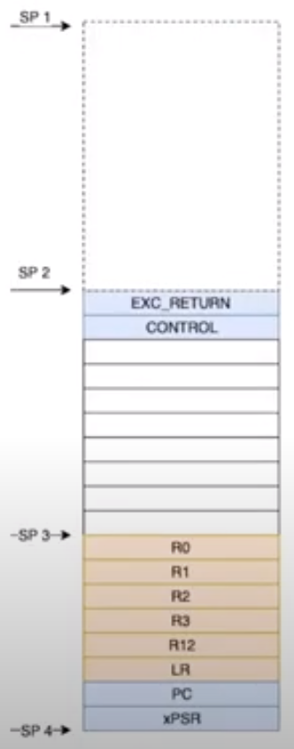

  this function starts with validating it's input values then
    - assign stack pointer of the thread which will be after thread TCP we can find this by knowing that we have stack size of 8kbytes and 18 word then thread-sp = sp + size*8 - 18*4
    - also TCP consists of exception return at the end to identify which stack is used msp or psp and return to FPU or not while context switching
    - also this function is going to be called from the SVC handler function
3. **RTOS_threadGetCurrentReady** function
  this function is going to get the highest priority(lowest index in the ready list) thread in the ready list

### some notice here for our RTOS

- our create thread function calls svc function that is going to trigger an interrupt and stack all create function parameters into main stack pointer then the interrupt reads the svc command parameter from **LR** register then save current **LR** to **execReturn** variable then call SVC main handler function which is going to check the SVC operation according to svc immediate argument then calls it's function which will be RTOS create thread function with arguments from the main stack pointer pointing to TCB of current scope at svc create thread function :D.

- while command **svc 1** we have a context switching that pushes all the current r0 to r3 into main stack pointer that we will use while calling the function inside the SVC interrupt handler which can be fetched from main stack pointer pushed while svc call which enables us to retrieve input parameters of the function calling svc command

- also we need to notice that immediate value of svc command can be retrieved from a link register **LR** to identify operation that user asks for which we will handle inside our RTOS kernal so users or tasks can't execute kernal or access any resource without kernal command privilege so application tasks can focus on app logic

- shifting can represent digits we need to pass in order to access a certain location in memory so we need to access 0,1,2,3,.... which will apply to locations or bytes 0,4,8,12,... accordingly so we can shift by 2 meaning multiplying by 4 operation which will apply to 1<<2,2<<2,3<<2,.... respectively this technique is used in stack pointer TCB while creating a thread so keep going there is more comming :D.

---

## **Scheduling and Mutual Execlusion**

### Priority based scheduler

- scheduler is the part od the kernel responsible for determining which thread will run next , most real time kernels are **priority based**.
- types of the priority based kernels : **preemptive and non-preemptive**
- when many threads have the same priority, scheduler can use **round-robin scheduling** allowing equal share of the CPU.


#### non-Preemptive (COOPERATIVE) kernel

- require that each task does something to explicitly give up control of the CPU. thread cooperate with each other to share the CPU.
- low interrupt latency
- non-reentrant functions can be used
- less need to guard shared resources
- lower responsiveness, not recommended for real time applications

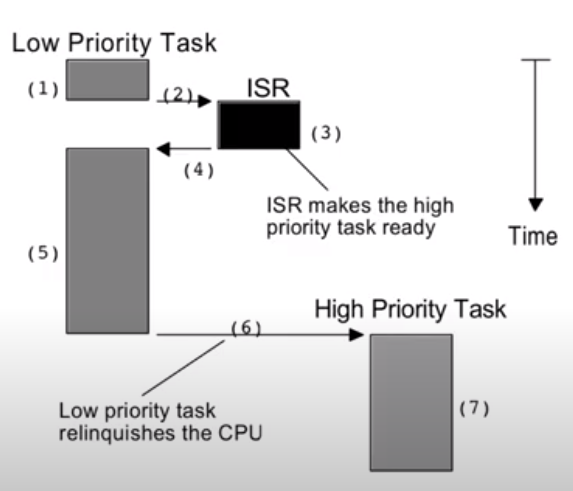

#### Preemptive Kernel

- very **high system responsiveness**, most of RTOS kernels are preemptive.
- Highest priority thread ready to run is always given control of the cpu
- current **thread is preempted** when a higher priority thread is ready
- **non-reentrant functions shall not used** without execlusive access such as swapping function if interrupt change values then swapping will be corrupted so we can call swap function a non-reentrant function which means we can't enter and renter again because of interrupts which will corrupt its resources and we need to use execlusive access such as mutexes and semaphores
- lower priority threads may never be run (**starvation**) because of high priority task keep comming over and over.  

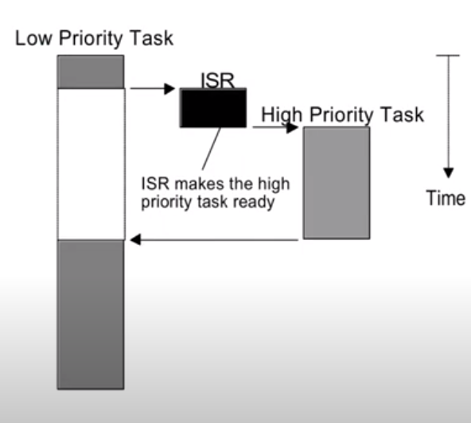

- **DeadLock** may cause corruption to high priority access which cause high priority task to fail.

### **Start Scheduling** function

this funciton will start execution of threads with help of svc call
but first we need to create an **idle thread** and add it to the ready list to let the scheduler always running we need to at least have one dummy thread running called idel thread which is always located in ready list.

if all tasks get into waiting list which is not supposed to happen we will need to run the idel thread

here also we need to fetch the highest priority thread and set it to the running thread

---

## **Mutex, Semaphore and MailBox**

### Mutual Execlusion

- Two or more threads may want to use **non sharable hardware**, or accessing **shared memory** simultaneously.
- atomic operation can solve the problem, but no processor can update a memory location with one instruction.
- one way to use critical sections (threads can not preempt) when accessing shared resources.
- critical sections is the piece of code which access shared resources.
- critical sections can be implemented by disabling interrupts, which could increased interrupt latency.

### **MUTEX**

- flag that can be tested and updated atomically
- mutex has two states
  - 1 (no thread in the critical section)
  - 0 (one thread in the critical section)
- each thread checks the mutex before entering the critical section, if the mutex is 1, the thread sets the mutex to 0 (mutex lock) and enters the critical section and back to 1 (mutex release) after leaving.

- MUTEX implementation using ARM CM4 synchronization primitives
  - non-blocking mechanisms that a thread or process can use to obtain execlusive access to a memory location
  - using Load(LDREX) and store(STREX) register execlusive instructions
  - load and store with exclusive operation used as pair with the same address
  - if a store-execlusive instruction performs the store, it writes 0 to its register if it does not perform the store, it writes 1.
  - while execlusive operations **LDREX and STREX** a local monitor is watching the **LDREX** operand1 (R0) so if any one trying to access it in a new thread or interrupt or another CPU-core it will write (STORE at **STREX**) 1 not the **operand2** of STREX command to it in the other(second) scope which will not lock the mutex and will wait to first thread or core to finish
  - we can disable interrupts before and enable it after but this will increase interrupt latency(decrease system responsiveness) and will not be suitable for multicore processor
  - MUTEX implementation in RTOS
    - if a thread is not able to lock a mutex, RTOS shall freeze its context, move it into waiting/blocked list and trigger context switching
    - the scheduler shall run the next high priority ready thread
    - whenever the mutex got released, RTOS shall wake up the blocked thread and move it into ready list and trigger context switching.
    - Mutex lock and release operations are RTOS responsibility and shall be implemented using RTOS calls.
  
    - The processor removes its exclusive access tag if:
      - It executes a **CLREX** instruction
      - It executes a Store-Exclusive instruction, regardless of whether the write succeeds.
      - An exception occurs. This means the processor can resolve semaphore conflicts
        between different threads.
  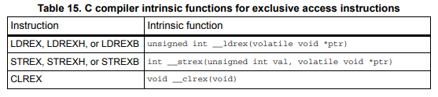

- Mutex codeing tips
  - it consists of a **structure** having a mutex value and mutex list which contains thread items want to lock this mutex or take it while it is already locked by another thread

    ```C
      typedef struct
      {
        uint32_t mutexValue;            /**< Mutex value */
        RTOS_list_t waitingList;        /**< Waiting list of the mutex */
      } RTOS_mutex_t;
    ```
  
  - then we have a **RTOS_SVC_mutexCreate** function that takes in
    - **mutex structure**
      - this structure contains the waiting list and the mutex value which will be the flag going to be taken and release
      - **wait flag**
        - this value represents waiting state while this flag is been taken so if another thread want to lock this mutex while it is been alreadt locked then this thread will be removed from ready list and will be added to waiting list in order of **item value** ascendingly
    - **function operation**
      - this function going to enter in a while loop and only will get out of it only when lockeing the mutex or found it is already locked
        - if it succedded locking the mutex means perform **__LDREXW** and **__STREXW** successfully and **mutexValue = 0** it will return with **return status 1**
        - if it found that this mutex already locked then it will move this thread from ready list to waiting list localized in mutex structure (meaning waiting list is local to mutex scope :D ) and will return with **return status 2** meaning that it will try locking the mutex again after context switching this happen by moving **PC** of this thread to **PC-2** which means calling svc instruction with mutex lock command performing locking operations again
  - then we have **RTOS_mutexRelease** function which takes in the mutex structure
    - **function operation**
      - this function only releases the **mutexValue =1** and move the next thread in waiting list or the lowest itemValue inside the waiting list (ordered ascending from lets say 0 to 10 also on each insert it inserts it in order keeping its item value order) ,it moves the lowest itemValue in waiting list to the ready list in order to be executed which its' PC points at svc instruction and will try locking the mutex again meaning that all threads in the waiting list will do the same operation

  - **notice that we can't nest mutexes blocks between lock and release avoid moving the same thread item into two waiting list of second mutex** and retrieving it back into the ready list within the same block which will casue the second mutex lock to remove the thread item from the first mutex waiting list to the second mutex waiting list causing a the control of this thread moving to second mutex and first mutex will be empty or a dummy mutex and its release will retrieve none from the waiting list means it has no purpose

### **Semaphore**
  
- Resources can be shared between limited number of threads
- Mutex is a binary flag and can be extended to a counter to support access from multiple threads.
- semaphore is functionally similar to the mutex but with counter
- mutex is considered a binary semaphore

semaphore is the same as mutex except that we didn't check its binary value so on each give it will safely increment semaphore value while in take it will decrement it's value and while its creation we can set its value and the same as moving it to the waiting list while there is a thread wants to take that semaphore while it is already taken or its value can't be taken because of its condition which for us is that the semaphore is == 0 :D we can change that and pass it to our function but till now it is very enough then while giving this semaphore we retrieve the items in the waiting list of this semaphore to the ready list in order to retry taking the semaphore again :D
  
notice that we can't nest different semaphores becasue the second one will have the control of the threads in the waiting list and first one will be a dummy semaphore and we can't depend on it, because it will be detached from the real thread scope
  
also notice that we can depend on that the **SVC** interrupt have the highest priority so no interrupt will preempt this operation and no one can racing this one while it is running but if we used NVIC to reduce its priority then we will found an issue and we will need to make it a critical section by disabling interrupts before and after setting mutex or semaphore value but that will issue a problem which causing the interrupt to be delayed which may be a critical event so this is not an efficient one and hence we really need to use **exclusive operations** in order to add dynamic configuration for our RTOS which enables increasing and decreasing priority of svc interrupt according to our application

### **Mailbox**

- used for interthread communication, unlike semaphores which provide only synchronization with information exchange.
- using shared buffers, one thread can fill the buffer(provider),the other empties it(consumer).
- the consumer needs to wait when the buffer is empty and the producer need to wait when the buffer is full.
- shared buffer needs to be updated by the producer and consumer mutually execlusively, so mutex is need for mutual exclusive access to the buffer and semaphore for counting number of messages in the buffer.
- buffer has limited size, producer can not fill the buffer infinitely, so another semaphore is needed for counting the empty slots in the buffer.
- can be implemented using queue and number of data in queue can be represented by semaphore.

it is nothing more than a QUEUE but it's **ENQUEUE and DEQUEUE** operations need to happen in a safe manner so we can make this operation inside mutex block or mutex like functions in order to notice each thread with a live version of queue buffer and avoid racing on the buffer also when state-machine programming come into the picture we can use maibox for message notification or event message that moves the operation between different states
  
**Notice** we need to avoid nesting mutexes ,semaphores and maiboxes to avoid moving running thread into the last waiting list scope of the last called block(mutexes ,semaphores and maiboxes) which detaches scopes from its logical operation which make it with no effect or its effect will rely on other scopes so as functional component it will not have a concurrent functional operation so take care of this while implementing your app using this RTOS

---

## **Timer Support**

### why we need timer support?

- threads normally do some actions and wait for respose such as sensor transmit the requested data
- external hardware like sensors are outside the control of our software
- using timers allows threads to wait only for a specific timeout instead of waiting forever if the sensor is not responding anymore, the software then can take recovery actions.
- threads also may need to stop processing such as delays waiting for some events and timeouts. (such as cooperative kernels)

### Synchronization Events with timer support

- threads whcih want to wait for some time are added into a timer list.
- threads can be also waiting for other synchronization events such as mutex.
- if the sync event happended or timeout, then threads are moved to the ready list and removed from waiting lists of the timer and the sync event.
- timer list shall be refreshed each tick event and the sync event waiting list shall be also refreshed in case of a timeout.

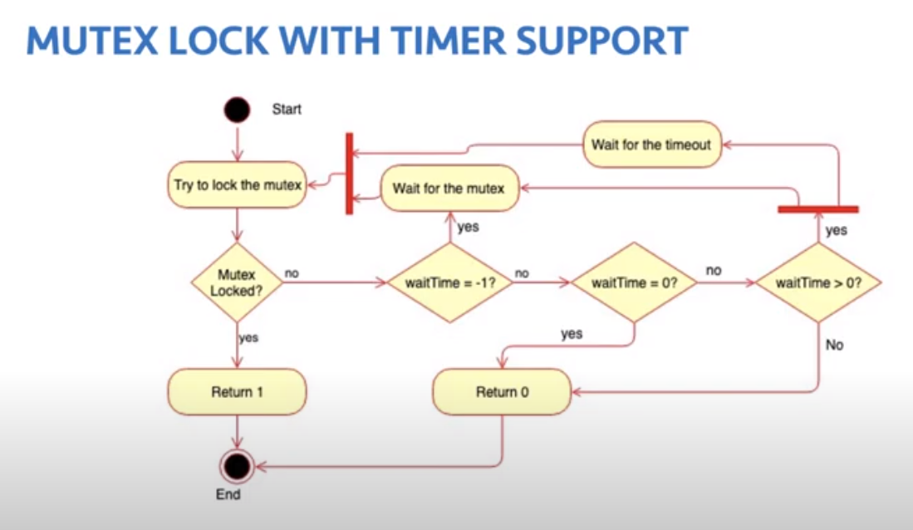

### RTOS Lists with Timer Support


### thread Destroy

- removes the thread completely from the RTOS system, i.e from ready list , timer list and all other synchronization events lists
- the running thread (supervisor) can terminate itself, or any other thread. it can also create new threads as well.
- supervisor thread shall make sure the terminated thread does not hold any RTOS resources (mutex, semaphore, etc.)

### **Key Notes**

- till now  we have 4 lists
  - **Running list** this list contains the running thread in case on single core and a multiple threads in case of a multicore
  - **Ready list** which is the lists ready to be running in the next tick ordered accordingly to item value and priority where each priority have a list of threads at this priority running circularly in order according to itemValue
  - **Waiting list** this list is local to scope of waiting event which represent waiting for a certain mutex, semaphore or maibox buffer so each object of those have a waiting list on that resource but what if the waiting is on the cpu resource? here comes timer list
  - **Timer list** this list contains items ordered ascendingly according to waiting time which is been passed to item value in order to prioritize them for time delay value

from those lists we notice that each thread may need to wait for a certain time on a certain resource **so what we can do ?**

**can we move the same item to waiting and timer list ?**

we shouldn't do that because while any event have come wheather it is time event or mutex relase we can move this item to ready list but how can we move the same item to two different lists without modifying the **list item structure** ? becasue each item only points to one list

we can make or tie each thread to two list items **generic_list_item** and **event_list_item** and we can move generic_list_item between ready and timer list which is global to our RTOS structure and move event_list_item into local resource waiting list such as mutex, semaphore and mailbox and with the help of that structure we can add the same thread into two different lists event list and timer list which enables us to add timeout cabability to our events or waiting lists

- thread destroy cabability allows us to remove the thread from our main RTOS scheduler list but it's structure is still localized in our .bss in RAM so that would help us to retrive and add it againg into running list by recreating it again but we need to check that its thread id is not re-initialize again in order to trach it correctly in the thread analyzing tools such as **Tracealyzer**

---

## **Priority Inversion**

- it is a problem mostly happen in RTOS with preemptive scheduler
- higher priority threads(HPT) have to wait for lower priority threads(LPT) to finish their execution, when they locking non sharable resources
- lowering the responsiveness and causes system malfunction when higher priority threads have stringent deadlines

- Bounded Priority Inversion

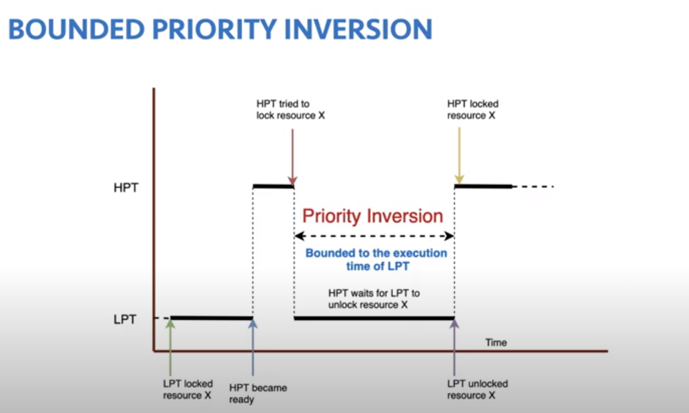

- Unbounded Priority inversion


- Priority Inversion Solutions
  - unbounded priority inversion can be solved by increasing the priority of LPT untile it unlocks the resource
  - Commonly used approaches for unbounded priority Inversion
    - Priority inheritance
    - Priority Ceiling
  - Bounded priority inversion can be solved with a system design minimizes the sharing between LPT and HPT
  - Execution time of LPT sharing resource with HPT have to be considered when calculating the schedulability and meeting the deadlines

- Solutions of Unbounded Priority inversion
  - Priority Inheritance
  
    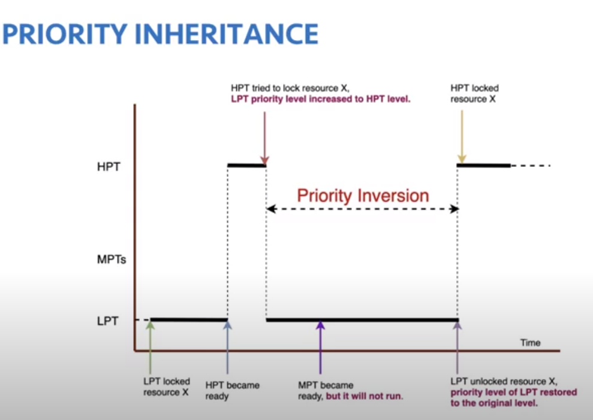
  
    while moving or suspending the HPT we increase the Priority OF LPT or make it equal to HPT which give it much time to release the resource and allow the HPT to execute but now the CPU is shared between HPT and LPT which would be at the same priority list
  
    this can be done by making a holder for each resource which will contain the priority of the LPT which will be set to HPT priority and while releasing will be brought back to its actuall priority

    notice that this priority inversion can't be done in application design like priority ceilling because it involves internal checking of resource availability so we need to modify our RTOS

  - Priority Ceiling
  
    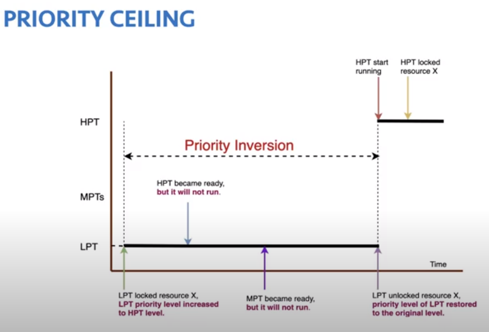

    here we tie the priority to the resource itself so if it is used in HPT then we give the LPT the priority of that HPT and wait till it finished and then call HPT that also delays the HPT that its time or delayed by bounded time value
  
    we can handle this by creating a basePriority property in thread TCB object and while locking the resource of LPT we give it the highest priority of this resource it wants to unlock and while releasing this resource we need to return the basePriority of this thread (LPT) to the current priority and we need to create a property for our resource that identify the highest thread priority that uses this resource in order to set it to current priority while locking the resource

    also we can take care of that in our application design and set the priority by hand while implemeting the application
- **Operational Functions**
  - **Priority Inversion**
    first we need to modify the thread object to have origiPriority property in order to change the running priority to the HPT's priority so we can retrive LPT's priority
    also we need to add a new property to mutex object to have the thread that holds this mutex in order to change its priority to HPT's priority  
    then we need to modify our LOCK and Release functions so that during lock operation if the thread is waiting for another thread which has lower priority then change its priority to the HPT's priority so that it can run alongside the HPT and prevent medium threads and during release just we need to check if the current running priority have the same priority as original priority in the thread object
  - **Priority Ceilling**
    this method can be wraped from the application perspective by setting the priority of the current running thread so our RTOS has to provide APIs to Get and Set the priority of the running thread without any modification to the thread object

---

## **DeadLock**

- Several threads compete for limited number of resources
- when the resource not available the requesting thread switched to waiting state
- requested resource already held by another thread in the waint g statem waiting for the requesting thread to release another resource.

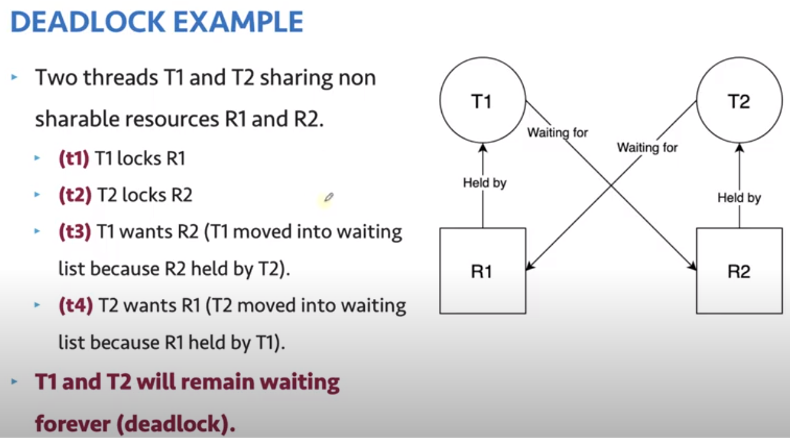

we can represent the **circular wait** (DEADLOCK) with **Resource Allocation Graph method** which is a method used to visualize resource allocations, and requests in the system where threads are shown with circules, resources are shown with rectangles and blacks dots represent mutex that can share the resource and if many dots found in the resource that mean we have a number of instances from a certain semaphore also arrow from a thread to a resource indicates an request or a wait and arrow from a resource to a thread indicates an allocation.
  
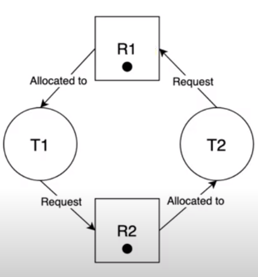

some Examples
  
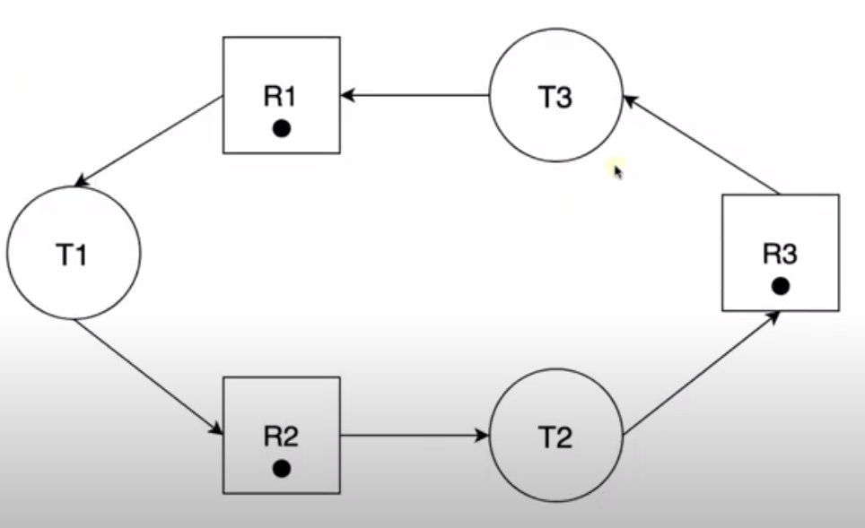

- **Dead Lock Conditions**
  - **Mutual exclusion**
    - System should at least has one resource shared between many threads
  
  - **Hold and wait**
    - all threads wait for more resourcesm without releasing the resource they hold
    - such as locking a mutex and wait till this mutex released by another thread
  - **No preemption of resources**
    - allocation of resources can not be cancelled only released from the holding thread
  - **Circular wait**
    - resource allocation graph should show a circular wait (when resource with one instance)
    - not all circular wait cause a dead lock such that
      - 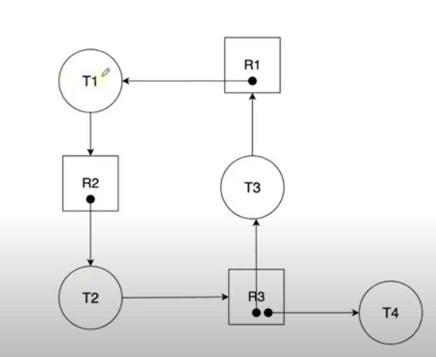
      - the outgoing arrow from T to R means **lock operation** the ingoing arrow from T from R means **Release operation**
      - also notice here that the reason why we didn't have a deadlock is that T4 doesn't apply to hold and wait it just request and release a certain resource so it breaks the loop that make other threads run properly

### Handling Deadlocks
  
- **deadlock prevention**
  - **Prevent Mutual exclusion** (not an efficient way as we doesn't have as many as that resources)
    - only one thread in the system using the resource.
    - can not be satisfied for many hardware decices.
    - means use different hardware resource for each thread which is difficult for example having 10 threads with 10 uarts :D
  - **Prevent hold and wait** (can be implemented easily)
    - no thread should hold the resource in waiting list
    - threads can request all resource they need at the beginning of the processing
    - threads can only request resources if they not holding any resources.
    - for example T1 locks R1 and go through execution then locks R2 which is requested by another thread so it enters waiting state on that R2 here hold and wait occurs,
  
      ****T1 Locks R1  
      ..... here T2 locks R2 then locks R1        this cause T2 enter waiting list for R1  
      ****T1 locks R2                             which will casue T1 to enter wating list on R1 and no task executes  
      ****T1 Releases R1,R2  
  
    and in order to prevent that we can release all resources before each locking to a certian resource

      ****T1 locks R1  
      ...... here T2 Locks R2 then locks R1 then Releases R1 and R2 after finishing its execution  
      ****T1 Release R1 then locks R1 and R2 this cause T2 to release R1 and R2 then T1 locks R1 and R2  
      **** T1 Releases R1, R2  

      this can be done from our application design and also by modifying our RTOS using create a Holder in TCB that contains holders of each thread that is need to be release before any lock operation beside locking with mutex to be locked again  

  - **prevent "no preemption of resources"** (difficult to implement)
    - when a thread in the waiting state its resources can be deallocated, and allocated to other thread.
    - saving and restoring the status of the resource is very difficult and impossible for some devices because we need to save register status of each configuration and reuse it again when switching back to this thread according to resource scope
    - can't be satisfied for many hardware devices
  - **Prevent circular wait** (can be made)
    - forcing threads to request resources in an increasing order of enumeration
    - Resource Enumeration Method
    - Each resource assigned to an increasing enumerated value, e.g. N1 fro R1,N2 for R2,N3 for R3 and so on.
    - thread can request a resource only when the enumeration calue of the new resource higher than the enumeration value of the resources it already hold
    - if a resources with lower enumeration value is needed the thread should release all resources with higher value than the new resource.
    - the thread can later request the higher enumeration value threads release to request low enumeration value thread.

    - **for example**  
      - 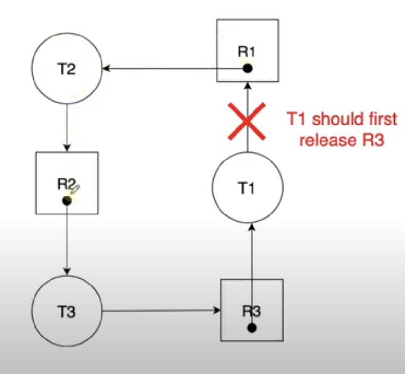
  
      - suppose we have  
        T1 Locks R3 then R1 then release R1  
        T2 Locks R1 then R2 then release R2  
        T3 Locks R2 then R3 then release R3  

      - to solve this issue we need to create a numeration value for each resource ordered in an increasing order such that  
        R1 -> N1(0)  
        R2 -> N2(1)  
        R3 -> N3(2)  

      - lets solve the example with new method discussed earlier  
        **** T2  locks R1, R2 this is correct because N2>N1  
        **** T3  locks R2, R3 this is correct because N3>N2  
        **** T1  locks R3, R1 this is wrong because N3>N1 so this should first release R3 then Lock R2

        so here we break the loop and notice in the implementation we can make this holder as a list so each thread can identify and check holder numeration value

- **deadlocks avoidance**
  - allocate resources so that there is always a sequence of threads (safe sequence) which can be satisfied with the resource requirements for unallocated and released resources in the system.
  - we can think of a semaphore instances as a control of the same peripheral but with different instance such as UART we may have UART1 ,UART2 and so on, so we can do this using semaphore instance checking where we can give and take from a semaphore value each with a certain peripheral module

- **deadlocks detection and recovery**
  - RTOS can run a routine periodically or when CPU utilization drops (longer time in idle thread) to detect deadlocks using deadlock detection Algorithms
  - after detections, the recovery algorithm has to be invoked to recover the system from deadlock
  - recovery can be done by system reset or by resources preemptions

- **manual reset when deadlock happended**
  - simple solution is to ignore the deadlocks, if they happen at low rate instead of running costly detection and recovery algorithms
  - if the deadlock happend, the system will be restarted manually or automatically e.g. using watchdog
