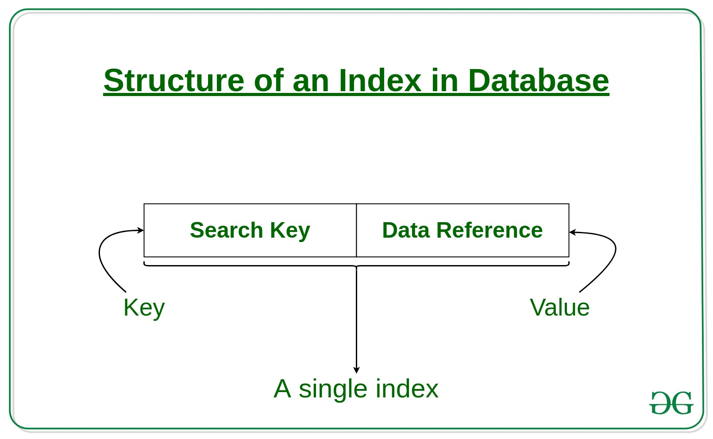
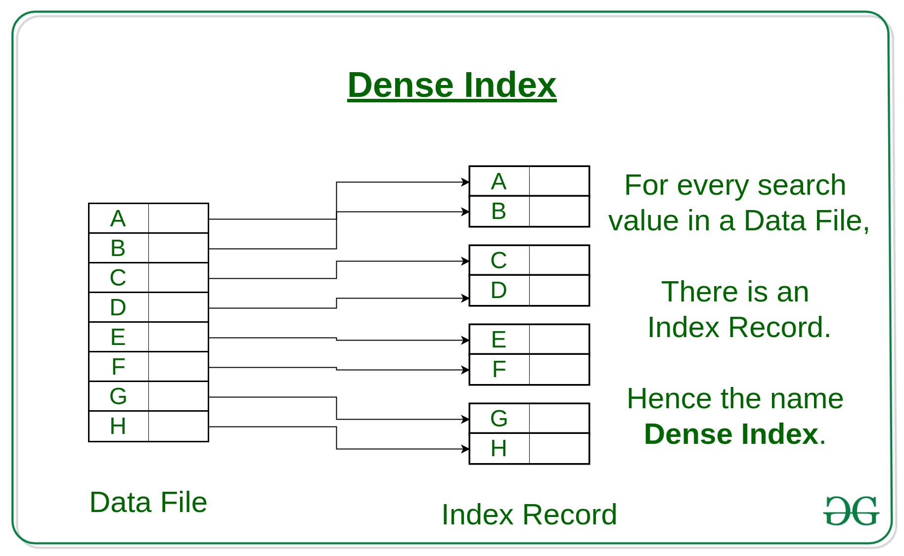
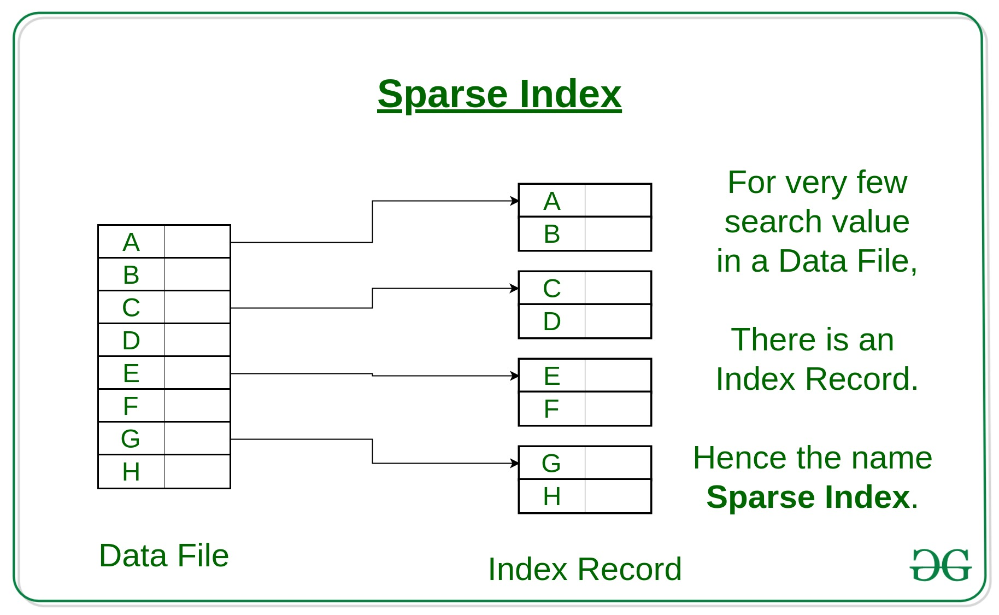
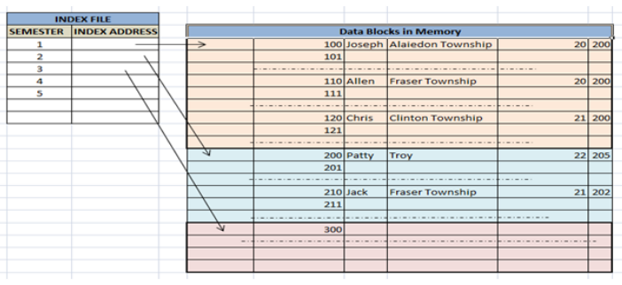
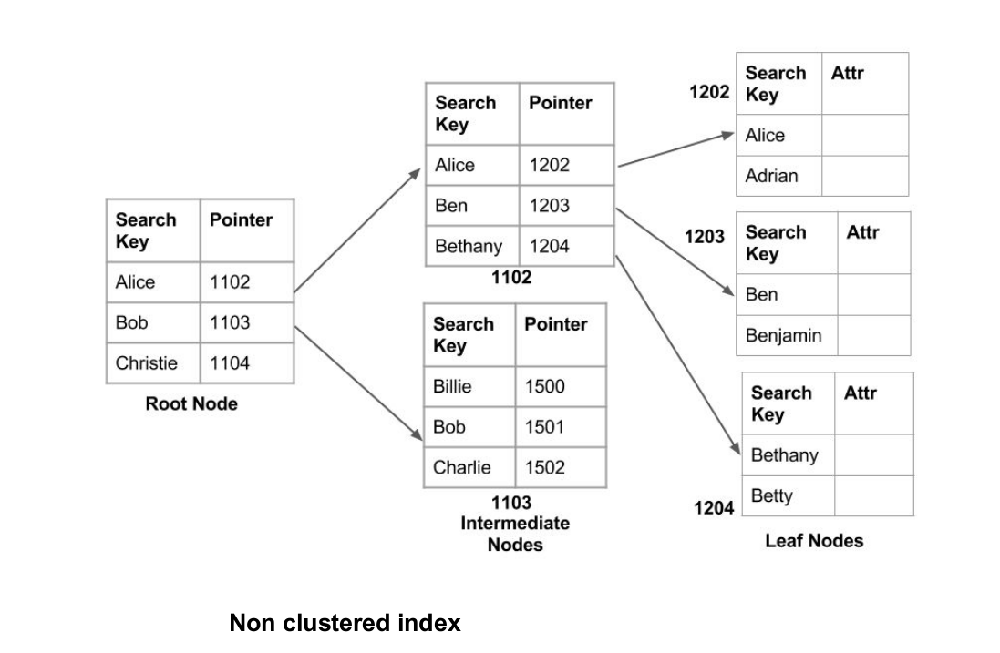
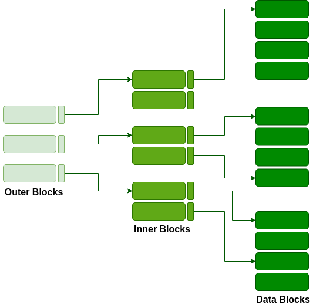

# indexing in Databases

- Indexing is a way to optimize the performance of a database by minimizing the disk accesses required when a query is processed.
- It is a data structure technique which is used to quickly locate and access the data in a database.
- Indexes are created using a few database columns.
  - **The first column** is the Search **key** that contains a copy of the primary key or candidate key of the table. These values are stored in sorted order so that the corresponding data can be accessed quickly.
  - **Note**: The data may or may not be stored in sorted order.
  - **The second column** is the **Data Reference** or **Pointer** which contains a set of pointers holding the address of the disk block where that particular key value can be found.
    

- The indexing has various attributes:
  - **Access Types**: This refers to the type of access such as value based search, range access, etc.
  - **Access Time**: It refers to the time needed to find particular data element or set of elements.
  - **Insertion Time**: It refers to the time taken to find the appropriate space and insert a new data.
  - **Deletion Time**: Time taken to find an item and delete it as well as update the index structure.
  - **Space Overhead**: It refers to the additional space required by the index.

- **In general**, there are two types of file organization mechanism which are followed by the indexing methods to store the data:
  1. **[Sequential File Organization or Ordered Index File](#sequential-file-organization-or-ordered-index-file)**
     1. Dense Index
     2. Sparse Index
  2. **[Hash File organization](#hash-file-organization)**
     1. Clustered Indexing
     2. Non-Clustered or Secondary Indexing
     3. Multilevel Indexing

## Sequential File Organization or Ordered Index File
In this, the indices are based on a sorted ordering of the values. These are generally fast and a more traditional type of storing mechanism. These Ordered or Sequential file organization might store the data in a dense or sparse format:  

- **Dense Index**:  
For every search key value in the data file, there is an index record.
This record contains the search key and also a reference to the first data record with that search key value.

- **Sparse Index**:  
The index record appears only for a few items in the data file. Each item points to a block as shown.
To locate a record, we find the index record with the largest search key value less than or equal to the search key value we are looking for.
We start at that record pointed to by the index record, and proceed along with the pointers in the file (that is, sequentially) until we find the desired record.

## Hash File organization
Indices are based on the values being distributed uniformly across a range of buckets. The buckets to which a value is assigned is determined by a function called a hash function.

There are primarily three methods of indexing:  

- [Clustered Indexing](#clustered-indexing)
- [Non-Clustered or Secondary Indexing](#non-clustered-or-secondary-indexing)
- [Multilevel Indexing](#multilevel-indexing)

### Clustered Indexing
When more than two records are stored in the same file these types of storing known as cluster indexing. By using the cluster indexing we can reduce the cost of searching reason being multiple records related to the same thing are stored at one place and it also gives the frequent joining of more than two tables (records). 
Clustering index is defined on an ordered data file. The data file is ordered on a non-key field. In some cases, the index is created on non-primary key columns which may not be unique for each record. In such cases, in order to identify the records faster, we will group two or more columns together to get the unique values and create index out of them. This method is known as the clustering index. Basically, records with similar characteristics are grouped together and indexes are created for these groups. 
For example, students studying in each semester are grouped together. i.e. 1st Semester students, 2nd semester students, 3rd semester students etc. are grouped. 

### Non-Clustered or Secondary Indexing
A non clustered index just tells us where the data lies, i.e. it gives us a list of virtual pointers or references to the location where the data is actually stored. Data is not physically stored in the order of the index. Instead, data is present in leaf nodes. For eg. the contents page of a book. Each entry gives us the page number or location of the information stored. The actual data here(information on each page of the book) is not organized but we have an ordered reference(contents page) to where the data points actually lie. We can have only dense ordering in the non-clustered index as sparse ordering is not possible because data is not physically organized accordingly. 
It requires more time as compared to the clustered index because some amount of extra work is done in order to extract the data by further following the pointer. In the case of a clustered index, data is directly present in front of the index. 

### Multilevel Indexing

With the growth of the size of the database, indices also grow. As the index is stored in the main memory, a single-level index might become too large a size to store with multiple disk accesses. The multilevel indexing segregates the main block into various smaller blocks so that the same can stored in a single block. The outer blocks are divided into inner blocks which in turn are pointed to the data blocks. This can be easily stored in the main memory with fewer overheads. 

