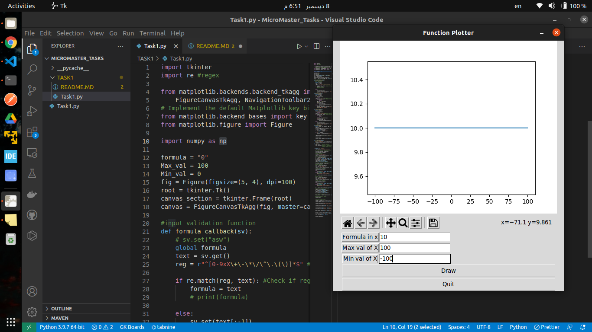
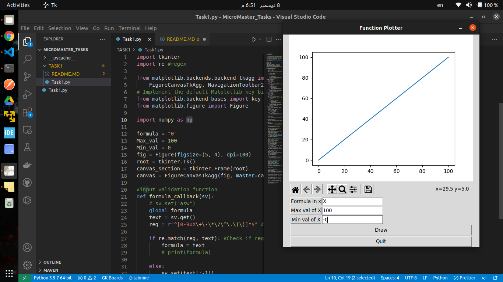
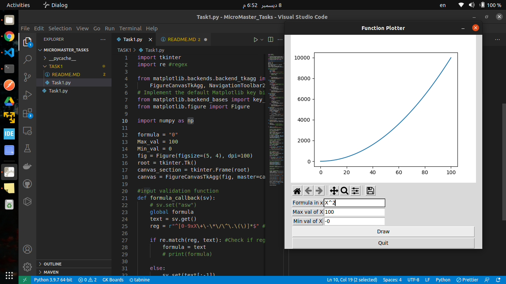
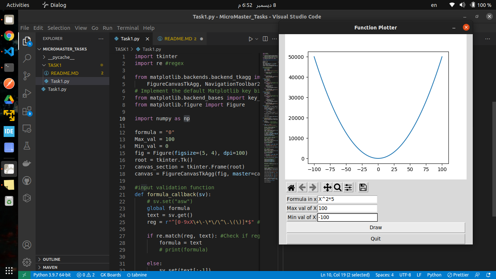

# Function Plotter

a python script plotting inputed function formula with x cartesian coordinate inputed constrains

## Table of Contents

- [Function Plotter](#function-plotter)
  - [Table of Contents](#table-of-contents)
  - [General Information](#general-information)
  - [Technologies Used](#technologies-used)
  - [Features](#features)
  - [Screenshots](#screenshots)
  - [Setup](#setup)
  - [Usage](#usage)
  - [Contact](#contact)

## General Information

- python is an easy programming language and have a powerfull comunity also i selected python because of my previous knowledge of Qt and tkinter
- here i used python 3.9.7 packed with **Ubuntu 21**

## Technologies Used

- here i used **regex**, **Tkinter**, **matplotlib** and **numpy** packages

## Features

- can draw n oreder function equations
- have a zoom in & out, move along each cartesian axis , save graphs and can reset to origin view.

## Screenshots







## Setup

- **Python 3.9**

   we need to install python3 on an Ubuntu machine if it is not found using commands

```BASH
    sudo apt update
    sudo apt install software-properties-common
    sudo add-apt-repository ppa:deadsnakes/ppa
    sudo apt update
    sudo apt install python3.9
```

- we need to install these python packages (**regex**, **Tkinter**, **matplotlib**, **numpy**)

```BASH
    pip install regex
    pip3 install tk
    sudo apt-get build-dep python-matplotlib
    pip3 install numpy
```

- then we can run the program with this command

```BASH
python3 Task1.py
```

## Usage

- can be used to draw nth order formulas and show a certain cartesian slice with x constrains inputed by user.

## Contact

Created by [@hazemkhaled3443](https://www.linkedin.com/in/hazem-khaled-90898315a/)
