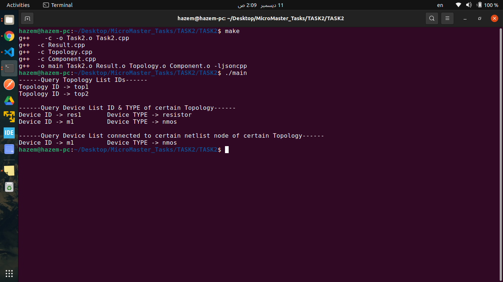
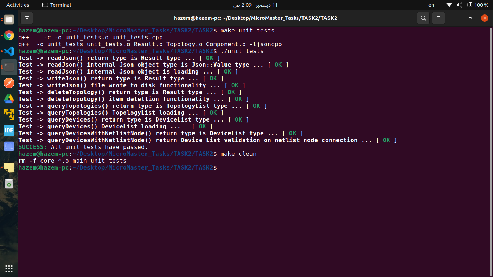
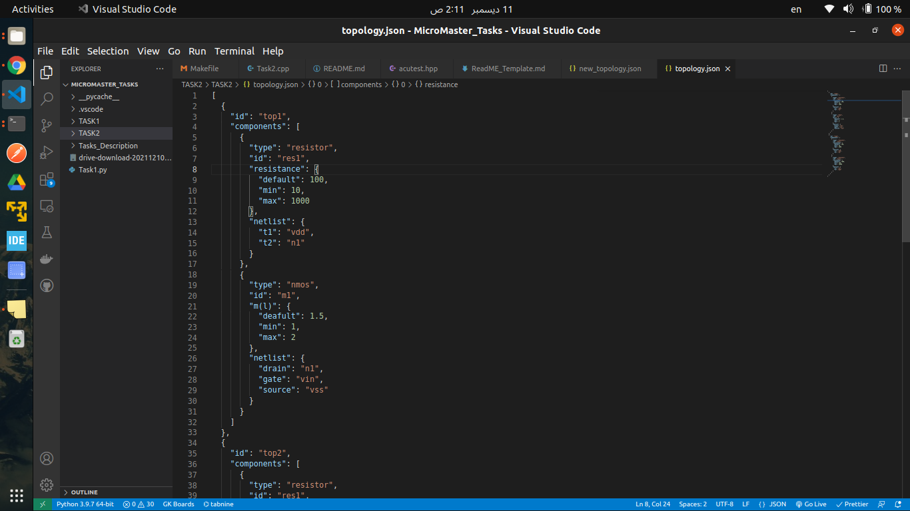
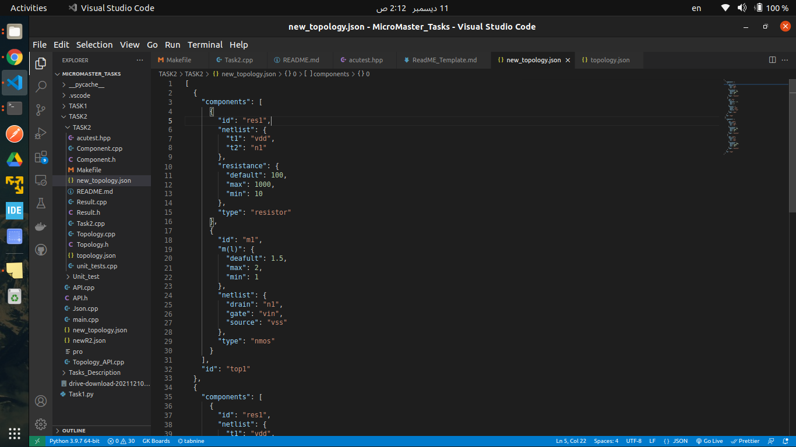

# Topology API Task

this code is to serialize a json file into an object and provide operations to be done.

## Table of contents

- [Topology API Task](#topology-api-task)
  - [Table of contents](#table-of-contents)
  - [General Information](#general-information)
  - [Technologies Used](#technologies-used)
  - [Features](#features)
  - [Screenshots](#screenshots)
  - [Setup](#setup)
  - [Contact](#contact)

## General Information

- I used **C++** here becasue it has **OOP** and **pointers** which make life :D
- also i belive if i can solve a probem in C/C++ so i can do it with any other language
- this code runs under **Ubuntu 21** which packed with **g++ version 11.2.0** and **GNU Make 4.3**
<!-- - also it is a statically type language so i can make use of it with functional programming codes -->

## Technologies Used

- **Jsoncpp** this module is used for parsing json file into map also for more info we can follow [this link](https://linux.tips/programming/how-to-install-and-use-json-cpp-library-on-ubuntu-linux-os)

- **acutest** used for unit testing and can be downloaded to our project as a header file of **.hpp** extension.

## Features

- provided **make** file to handle file compilation and cleanning after fininshing execution
- also provide make command for running test cases in order to test our code such that

    ```BASH
        make unit_tests
    ```

    or for tests summary we can run command

    ```BASH
        make unit_tests -v
    ```

## Screenshots






## Setup

- **Jsoncpp**
  can be installed using this command on **Ubuntu**

  ```BASH
  sudo apt-get install libjsoncpp-dev
  ```

- **acutest**
  used for unit testing and can be downloaded to our project using this command in our project folder

  ```BASH
  curl https://raw.githubusercontent.com/mity/acutest/master/include/acutest.h > acutest.hpp
  ```

  after installign all **jsoncpp** and **acutest.hpp** we can start building and running our code

  we need to run make to generate main output file

  ```BASH
  make
  ```

  then run main file

  ```BASH
  ./main
  ```

  also to run unit test

  ```BASH
  make unit_tests
  ```

  then run these tests

  ```BASH
  ./unit_tests
  ```

  then we need to clean our directory using

  ```BASH
  make clean
  ```

## Contact

Created by [@hazemkhaled3443](https://www.linkedin.com/in/hazem-khaled-90898315a/)
